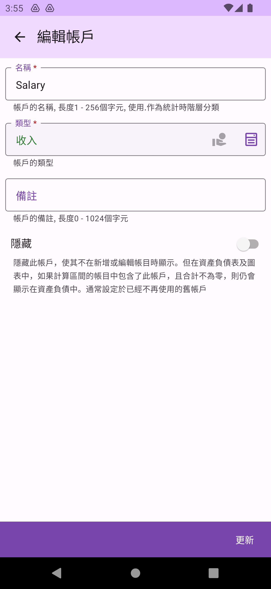

## 帳戶

帳戶是記帳的核心[概念](concept.md)中的第二項。您可以在`帳戶管理`頁面管理同一帳本下的帳戶。

### 帳戶分類

帳戶以收入，資產，支出，債務及其他等共五大類頁籤分類。

### 新增帳戶

點選`新增帳戶`後，將進入`新增帳戶`頁面。在新增帳戶時，請考慮您要使用的名稱，並且可以用 `.` 字元來進行樹狀分類。在資產負債表中，這樣的分類方式將根據父節點進行合併加總。例如：`住.房租管理費`、`住.水電瓦斯` 和 `住.電話網路`，這些項目將分別加總至 `住` 這一父節點。

除了名稱外，您還必須為帳戶選擇一個帳戶類型，這樣的分類有助於 App 在呈現上的處理。

### 帳戶選單

您可點選各帳戶進行編輯，或利用左右滑動來查看個項不同功能操作。在帳本右滑為刪除功能。

在帳本左滑為編輯，帳目列表及初始化功能。

### 編輯帳戶

編輯帳戶時，您可以變更帳戶的名稱和類型。資產負債表的統計是即時的，只要維持正確的名稱和類型，您不必擔心會對統計結果造成錯誤。

### 帳目列表

可查詢該帳戶在特定區間內的所有相關的帳目，包含不同帳本間的轉帳

### 初始化帳戶

初始化帳戶的實際動作是為帳戶添加一筆單向的初始帳目[^1]，通常在您最初建立新帳戶或開始使用本 App 時進行。這一步用來為帳戶設定初始值，例如銀行存款、已刷的信用卡金額或手上的現金。初始化帳目不需要設定轉帳的時間。並且只在資產負債統計區間不包含開始日期[^2]時才會被計算

[^1]: 雖然通常每個帳戶只有一筆初始化，但App並不作這項限制，只要加總的值的正確的，對資產負債統計並不會有影響。
[^2]: 僅`直到`今天或某天的資產負債統計因沒有開始時間，會包含初始化帳目

### 刪除帳戶

刪除帳戶後，相關的帳目部份資料也會被刪除，此操作會影響該帳本的資產負債統計，且不可逆，請小心執行。由於本 App 支援不同帳本間的轉帳，如果一個帳目屬於多個帳本，則只有該帳本中的部分資料會被刪除，不會影響相關聯帳本的總帳。但在查詢相關非帳本的該帳目時，被刪除的單邊資料（轉出或轉入）會丟失。