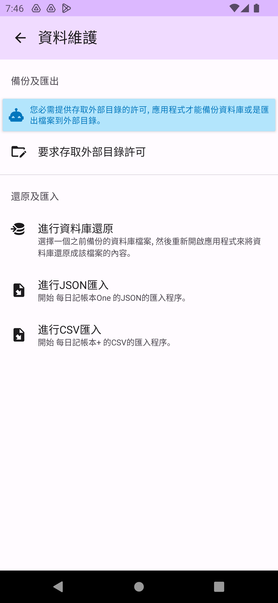
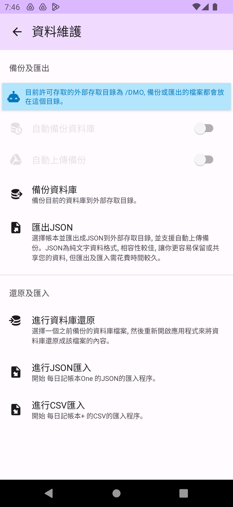
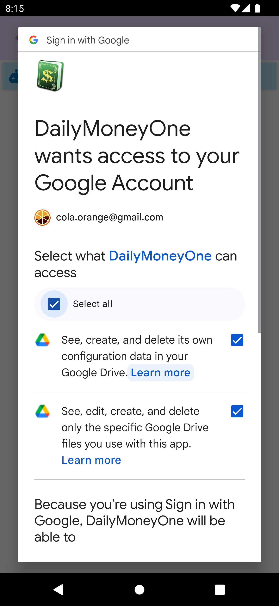
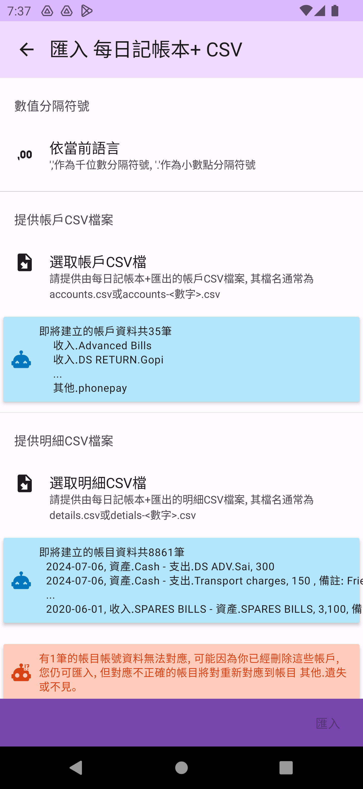

# 資料維護

資料維護頁面可進行多個類型的資料形式備份、還原或匯出、匯入作業。

## 取得手機儲存空間權限

在進行資料庫備份或匯出時，您必須先允許 DMO存取您手機目錄的權限。請點選`要求存取外部目錄許可`，並指定一個特定的目錄給DMO用於資料庫備份及資料匯出(請不要使用最上層目錄，部份手機不允許DMO存取最上層目錄)。

## 資料庫備份及還原

資料庫的備份會將DMO資料庫檔案複製到手機目錄。還原程序的最後一步驟則是直接取代 DMO的資料庫檔案，這是最快速且全面的資料備份及還原方式。點選`備份資料庫`即可將資料庫檔案，依日期時間格式為檔名備份(dm-_YYYYMMDD-HHmmss_.db)到手機目錄中。

點選`進行資料庫還原`後，會跳出資料庫檔案選取畫面，請選取要用來還原的資料庫備份檔案。DMO會將這個檔案複製到程式內，隨後請重新啟動DMO (用手機程序管理刪除DMO程序) 來進入還原步驟。

在重新啟動後，會再次詢問是否確定要進行還原，點選`確定`則進行還原，點選`取消`則略過還原。<mark style="color:red;">請注意，還原是不可逆的，請確定您有確實的備份，且選取了正確的還原檔案</mark>。

## 自動備份資料庫

您可以選擇是否開啟`自動備份資料庫`功能。啟用後，DMO將根據您的設定，自動進行資料庫備份。(自動備份的實際執行時間會依手機而不同)

您可以在自動備份資料庫頁面設定備份的`間隔天數`、`保留數量`及`保留天數`。

## 自動上傳到GoogleDrive

您可以選擇是否開啟`自動上傳 Google Drive`功能。啟用後，DMO將會要求您登入 Google Drive 帳號並提供存取權限。(若日後不想自動上傳可在[側邊功能列](home.md#ce-bian-gong-neng-lie)的登入資訊處登出)

在您登入並提供存取權限(需要Config及Specific Files讀取權限，這兩項權限不會讓DMO有權力讀取您上面的任何其他非DMO建立檔案)後，DMO會在 Google Drive 根目錄下建立一個 DailyMoneyOne 目錄，並在您進行資料庫備份或資料匯出時，自動將檔案上傳至該目錄。您可以在該功能頁面進行簡易的檔案刪除及下載管理。

## 匯出及匯出資料JSON檔

使用`匯出JSON`功能能將帳本、帳戶及帳目等記帳資料匯出成JSON格式。您可以選擇要匯出的帳本和帳戶，以及是否要匯出其中涵蓋的帳目。(匯出及匯入JSON將會比備份及還原資料庫花費更多時間)

點選`進行JSON匯入`功能來匯入先前匯出的 JSON 格式檔案。您可以在此時選擇要匯入的帳本(和帳戶)，以及是否要匯入其帳目。DMO會建立全新的帳本和帳戶，且同名的帳本不會被取代或覆蓋。

## 匯入Daily Money+ CSV

若您是從 Daily Money+ 轉移過來的舊用戶，請先在 Daily Money+ 上匯出 CSV 檔案，然後點選 `進行 CSV 匯入` 功能來匯入由 Daily Money+ 匯出的 CSV 檔案(請參考[影片](https://www.youtube.com/watch?v=IkZsiJ5TAyw))。若您所在的區域使用的千位符號及小數點格式非 `,` 及 `.`，請選取適合您的字符設定。然後再選取要匯入的 CSV 檔案。DMO會建立全新的帳本和帳戶，且同名的帳本不會被取代或覆蓋。

