# 桌面應用程式

桌面應用程式是[伺服模式](server-mode.md)中內建的遠端連線應用程式。啟動伺服模式後，您可以使用同網域內的其他設備透過瀏覽器連接並使用`Daily Money One 桌面`。連線網址通常為：`http://<IP位址>:<埠號>/desktop/`

## 連線認證

成功連線後，您會首先進入認證畫面，必須輸入啟動伺服模式時設定的連線通行碼。通過認證後，您才能繼續使用應用程式。認證將持續有效，直到您離開應用程式或關閉所有瀏覽器頁籤為止。為了安全起見，請在不使用時離開應用程式並關閉手機上的伺服模式。

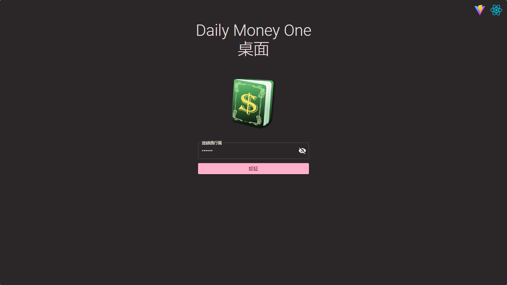

## 首頁

通過認證後，預設將進入首頁。左側為側邊選單，這裏可以選擇主要的功能及離開應用程式。上方功具列左方提供帳本的選擇選單，右方提供時間區間選擇。
首頁內容的第一排預設顯示當年的結算狀態，並以`資產`與`負債`、`收入`與`支出`兩組柱狀圖顯示。第二排依帳戶類型順序，列出第一個帳戶類型內各帳戶的結算狀態。

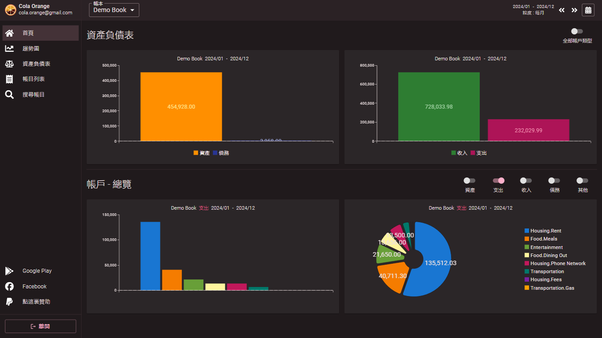

您可以使用上面工具列右邊的左右方向按鈕切換至上一個或下一個區間，或打開區間調整對話框來調整時間區間。

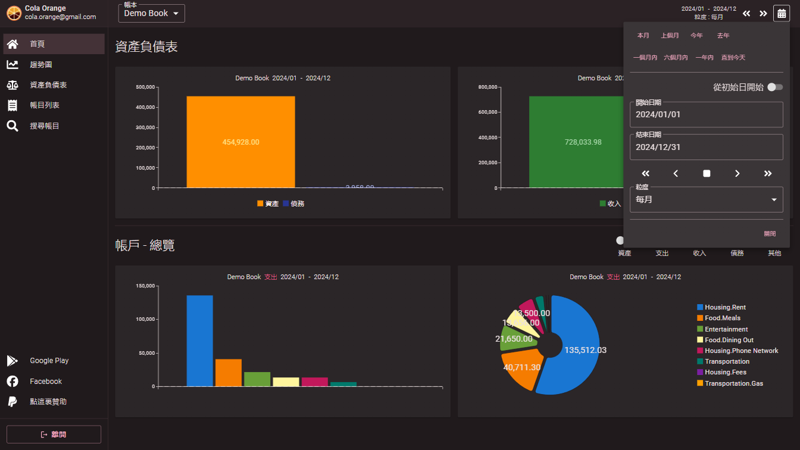

在首頁第一排，您可以啟用`全部帳戶類型`選項，將所有帳戶類型顯示在同一組柱狀圖中進行比較（此時才會顯示帳戶類型-`其他`）。

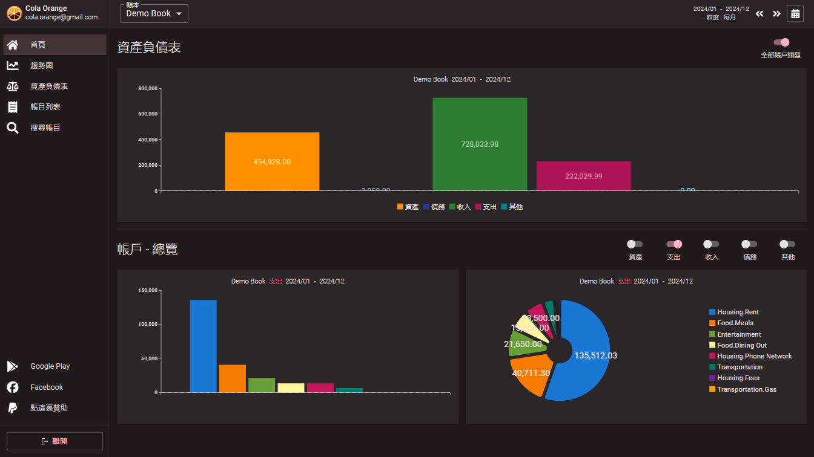

在首頁第二排及後續，您可以選擇想要查看的帳戶類型，以查看帳戶區間內的帳戶結算。

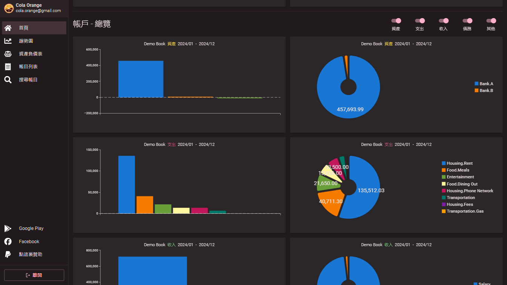

## 趨勢圖

點擊側邊選單中的`趨勢圖`，即可查看各帳戶類型或帳戶在查詢區間內的趨勢（即區間內的時間粒度的合計）。第一排顯示`資產`與`負債`、`收入`與`支出`兩組合計折線圖。第二排則依帳戶類型順序，顯示第一個帳戶類型內帳戶的合計折線圖。

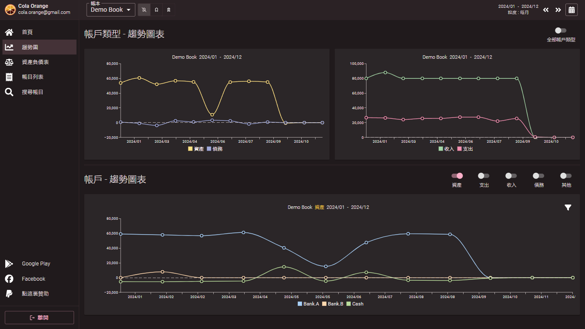

在功能列上，您可以啟用`累加合計值`選項，此選項會將區間內各粒度的合計值累加，並以區域圖呈現。

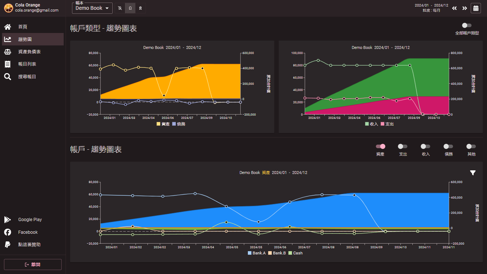

另外，您還可以啟用`初始加累加合計值`，此選項除了累加區間內的合計值外，還會加上初始值及區間前的合計值，以區域圖顯示。此功能可用來查看從記帳開始後，您總資產和負債或各帳戶在各時間點的變化。

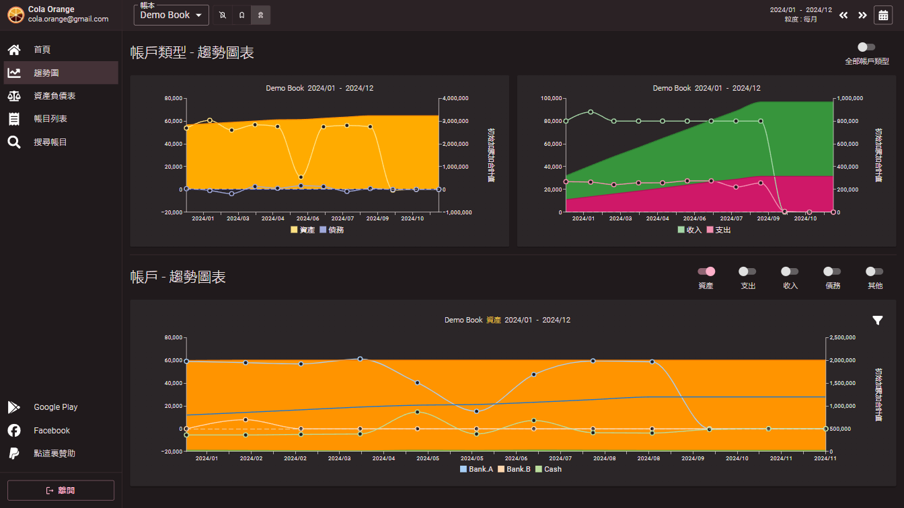

第二排的圖表會顯示選定帳戶類型的趨勢，同樣支援`累加合計值`及`初始加累加合計值`功能。

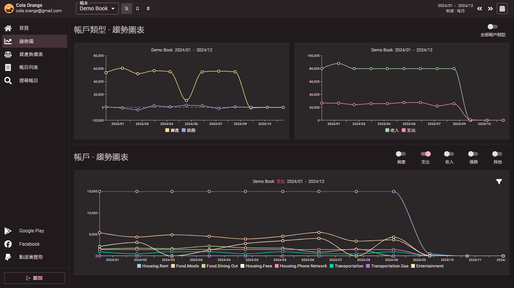

當帳戶數量較多時，您可以開啟圖表右側的帳戶過濾功能，選擇想要查看的帳戶。

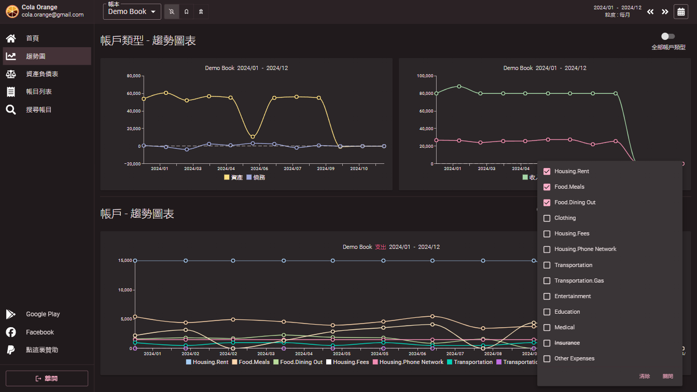

帳戶過濾功能是針對每個帳戶類型獨立設定的，並會顯示當前的過濾帳戶數。

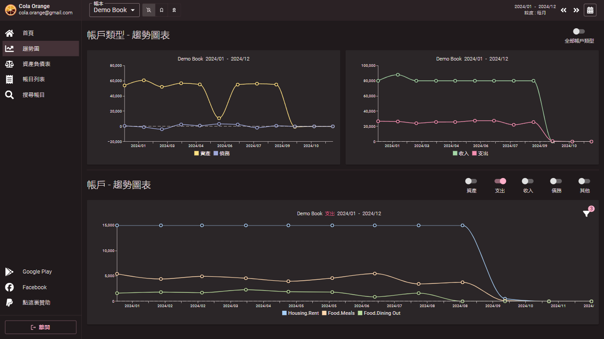

## 其他功能

持續開發中...