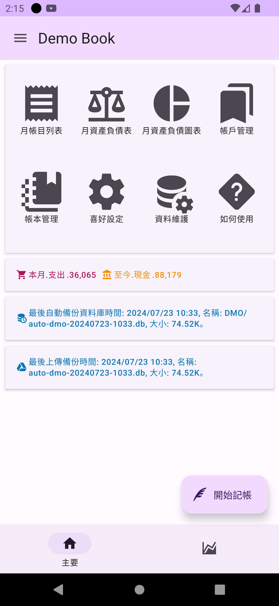
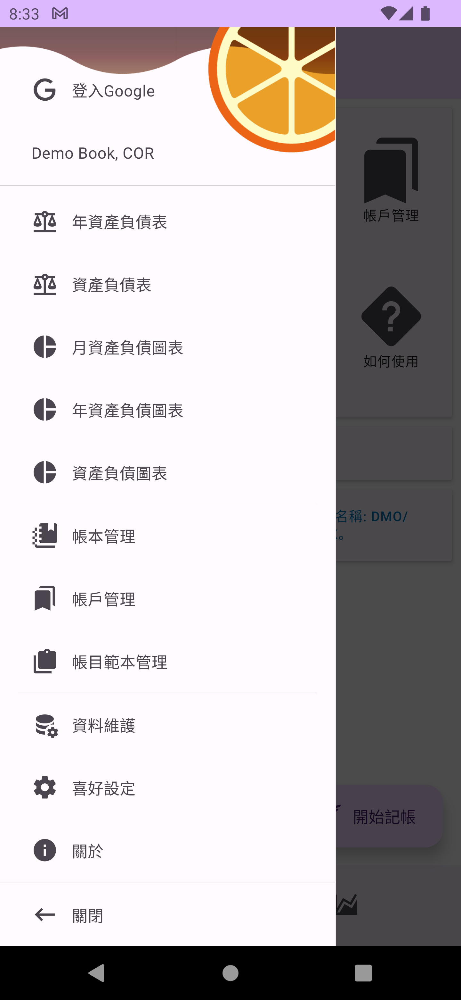
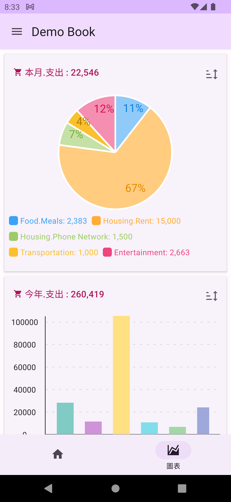

## 主頁

主頁為 App 的入口頁面，您可以在這個畫面上快速使用功能，並自定多項快捷功能，快速查看資產負債表及圖表，及系統資訊。左上角為開啟側邊功能列的選單，下方為主要功能及快速圖表功能的切換頁籤。

### 側邊功能列
側邊功能列中，您可以存取全部功能，並且登入 Google 來將備份檔案上傳至雲端。

### 快速圖表頁籤
在快速圖表頁籤中，您可以自定義常看的圖表，例如周支出或月支出圖表。

