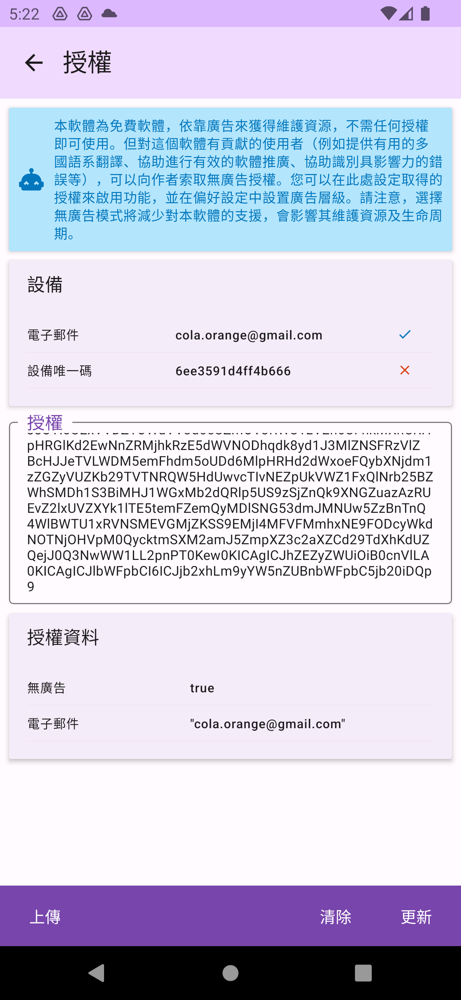

# 授權

本軟體為免費軟體，依靠廣告來獲得維護資源，不需任何授權即可使用。但對這個軟體有貢獻的使用者（例如提供有用的多國語系翻譯、協助進行有效的軟體推廣、協助識別具影響力的錯誤等），可以向作者索授權。

## 匯入授權
您可以在`關於>授權` 畫面設定取得的授權，授權可綁定電子郵件或是設備唯一碼，其中任何一者符合即視為有效授權。並在偏好設定中設置廣告層級。請注意，選擇無廣告模式將減少對本軟體的支援，會影響其維護資源及生命周期。

* 無廣告之授權，依取得的授權內容，可能會有限定時間或無時間限定。
