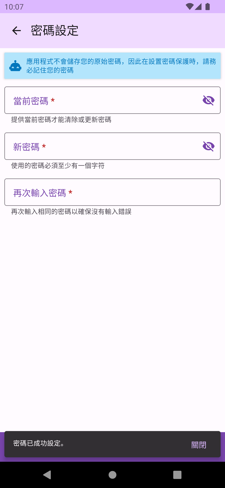

# 密碼保護

密碼保護功能為DMO提供了使用者的身份驗證。若建立了密碼，將在DMO啟動時，會詢問使用者輸入密碼來驗証身份，才能繼續使用。

## 建立密碼

在 `安全設定` 頁面中，使用 `密碼設定` 來建立一組密碼。密碼建立完成後，若忘記密碼將會影響您的使用，DMO不會儲存你的原始密碼，請務必記住密碼。

 

## 驗証密碼

DMO在重新啟動後，或在被切換到背景，再切回前景使用時，將會詢問使用者輸入密碼來驗證身份。

## 超時設定

密碼建立完成後，您可以設定密碼超時時間。在驗證後，若應用程式在背景和前景切換在超時時間內，則不會再次詢問密碼。若應用程式有被任何狀況重新啟動，則會一律重新詢問密碼。

## 更改或重設密碼

你可以更改密碼，或重設密碼(以取消密碼保護功能)。更改或重設密碼時需要當前的密碼。

 

