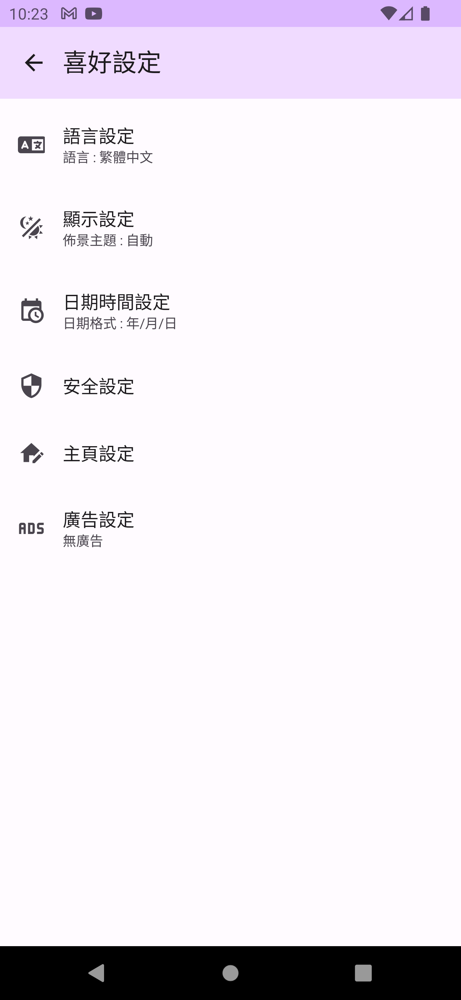
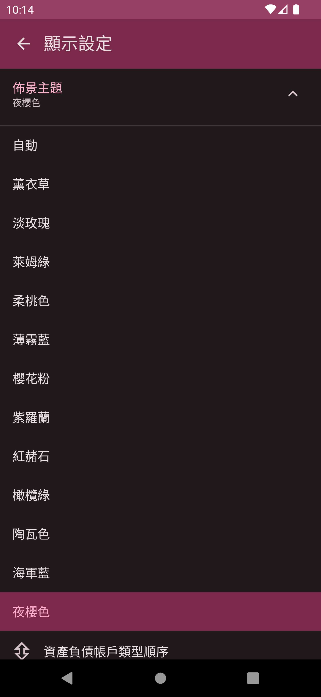
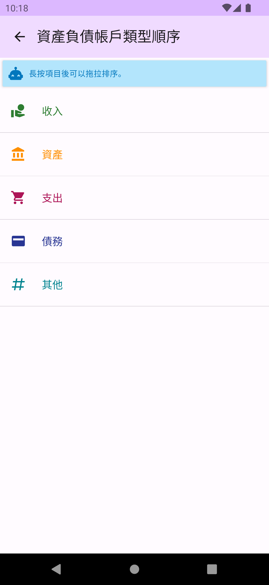
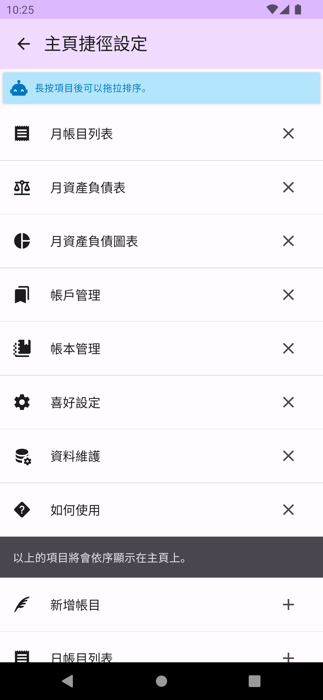
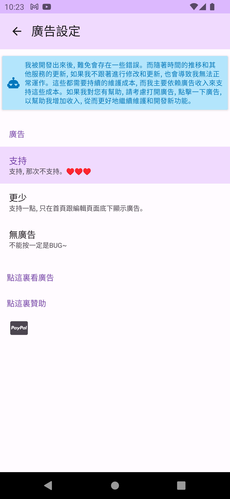

# 喜好設定

喜好設定提供除了帳務資料外的各項設定。

## 語言設定

設定DMO使用的語言​，預設會依您的手機語系設定決定。

## 顯示設定

設定各項顯示相關選項。

### 佈景主題

設定各式色彩主題。

 

### 資產負債帳戶類型順序

設定資產負債表的帳戶類型順序。

## 日期時間設定

設定日期時間格式及相關選項。

## 安全設定

設定各項安全選項，參考 [密碼保護](password.md)。

## 主頁設定

設定主相關選項。

### 主頁捷徑設定

重新安排主頁功能捷徑。

### 資產負債表快速檢視設定

重新排序主頁之資產負債表快速顯示順序或刪除其中的項目。

### 資產負債圖表快速檢視設定

重新排序主頁之資產負債圖表快速顯示順序或刪除其中的項目。

## 廣告設定

設定用套用的廣告層級。

