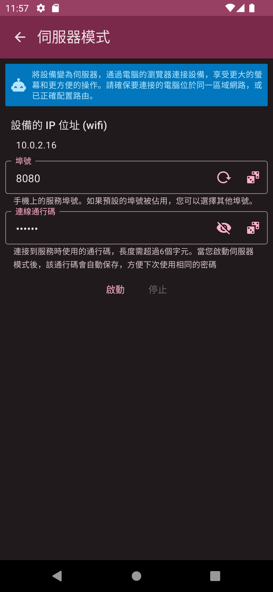
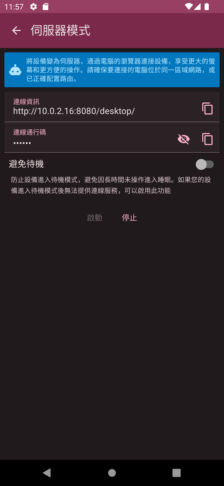

# 伺服器模式

伺服器模式提供您將手機變成一個伺服器，並能讓您經由同一網域的電腦或其他設備連線到手機進行相關帳本、帳戶、帳目或相關圖表的查詢。由於在電腦上可以使用滑鼠、鍵盤及更大的螢幕，這將使您更方便地查看及管理您的財務資訊。

## 連線設定

進入伺服器模式畫面時，您可以看到目前手機的網路 IP（依實際網路狀況而定）。由於連線的設備必須處於同一個網域才能連線，建議您使用 Wi-Fi 連線，或開啟 Wi-Fi 熱點模式。在啟動伺服器模式前，您必須提供連線的埠號及連線通行碼。連線埠號需介於 1024-65535 之間，連線通行碼則必須大於 6 位數。您可以任意變換這些數值，而最後一次使用的數值也會在啟動伺服器後被自動保存。請小心保護您的連線通行碼，避免同網域的其他用戶得知您的 IP 及埠號後進行連線。建議您每次啟動時使用新的隨機通行碼。

## 連線資訊

啟動伺服器模式後，畫面會顯示連線資訊網址（`http://<IP位址>:<埠號>/desktop/`）及您剛輸入的連線通行碼。在同一網域的電腦或設備上開啟瀏覽器並輸入該網址後，即可進入 [DailyMoneyOne 桌面](desktop.md) 應用程式，並在輸入連線通行碼驗證後，即可查看您手機上的資料。 另外，大部分的手機在放置一段時間後會進入待機狀態（螢幕會關閉等），這會使得伺服器模式無法繼續提供服務。為避免此狀況，您可以啟用`避免待機`選項來防止手機進入待機模式。由於手機在此狀態下會持續開啟螢幕並耗電，請記得將手機插上電源持續充電。

