# 帳目範本

帳目範本功能用於快速建立常用帳目，並提供定期重複發生類型帳目的排程。您可以使用帳目列表的[建立範本](transaction.md#zhang-mu-gong-neng)來建立新的範本。

## 建立帳目範本

在建立範本時，會帶入所選的帳目資料，但不會包含帳目發生的時間。除了必需提供範本的名稱外，您還可以選擇是否要套用轉出帳戶、轉入帳戶、金額及備註。此外你可以啟用要套用的項目(轉出帳戶，轉入帳戶，金額及備註)，在日後利用此範本建立帳目時，這些啟用的項目將會被套用。

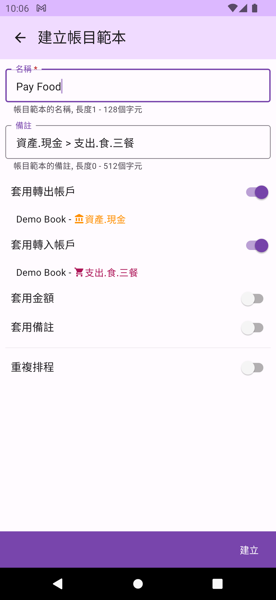

此外，您還可以設定是否要啟用重複排程。沒有排程的範本再為`一般範本`，否則稱為`排程範本`。

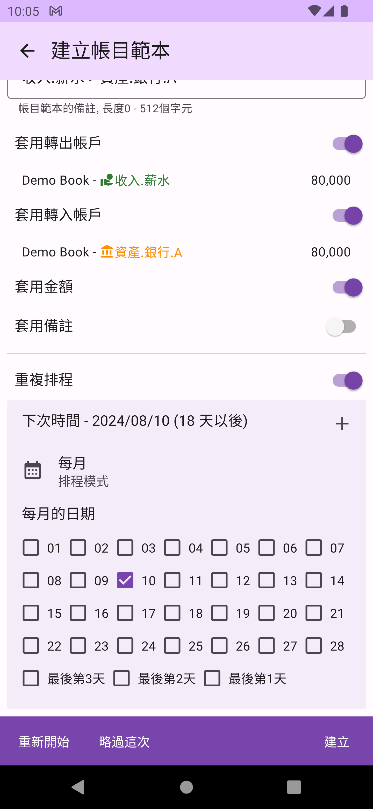

重複排程分為每周，每月及每年三種模式。

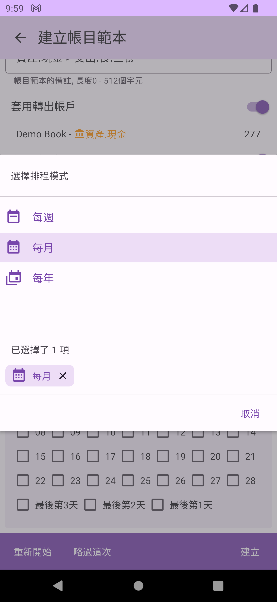

您還可以在一個項目上設定多個重複排程，且每個排程都可以擁有各自的模式，讓排程更容易滿足您的需求。在每次設定後，DMO將自動選擇最近的下一個日期作為排定日期。

## 帳目範本管理

在帳目範本管理頁面裏，分為`一般範本`及`排程範本`兩個頁籤，分別列出已經建立的一般範本及排程範本。

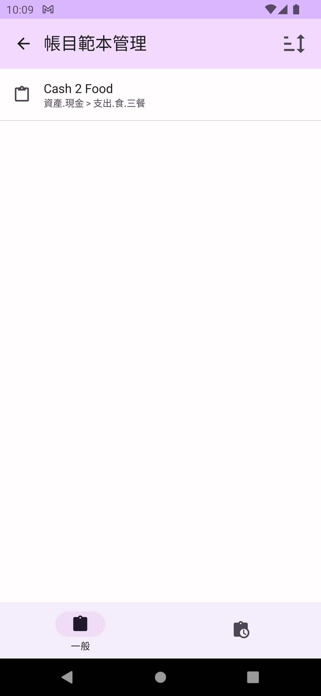

 

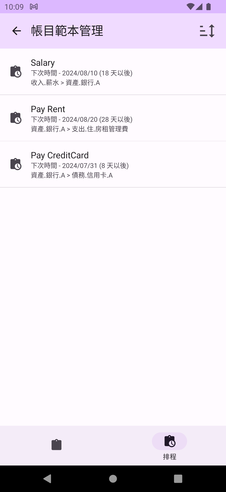

## 帳目範本功能

您可點選各範本進行`編輯`，或利用左右滑動來查看個項不同功能操作。在帳本左邊為`刪除`功能。

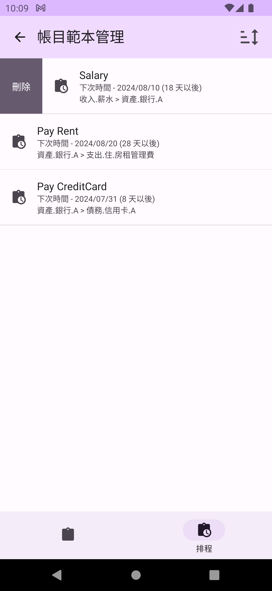

在一般範本右邊為`編輯`及`新增帳目`功能。新增帳目功能會將此範本資料帶入帳目建立的頁面，讓你更快速的建立一筆新的帳目。

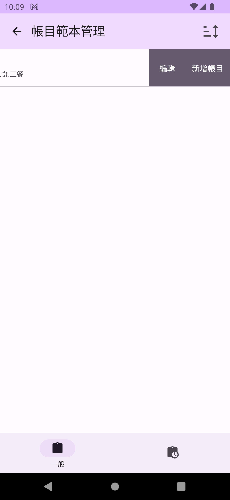

在排程範本右邊除了`編輯`及`新增帳目`功能外，還有`重新開始`和`略過這次`兩個排程功能。`重新開始`會以`現在的日期`及`排程設定`來重新設定的排定日期。`略過這次`則會以`排定日期`及`排程設定`來重新設定下一個排定日期。

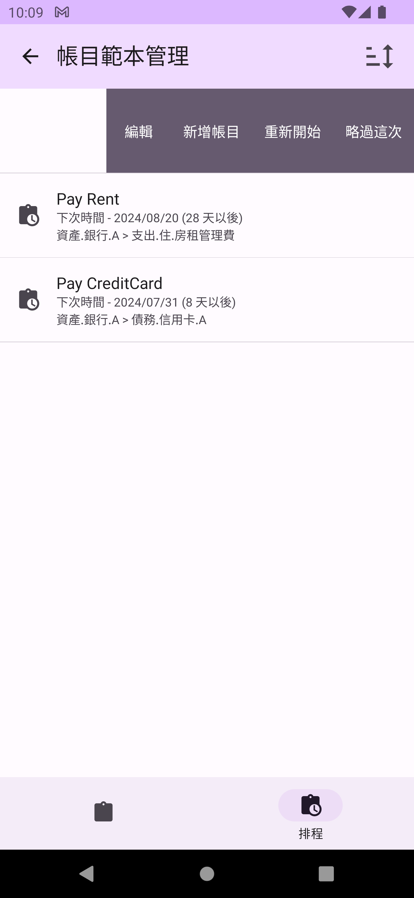

## 編輯帳目範本

在編輯帳目範本時，您可以修改名稱、各項套用設定及排程設定（目前尚未提供修改帳目資料的功能，日後再提供）。

## 快速叫出帳目範本

在主頁的`開始記帳`按鈕上長按，可以叫出帳目範本對話窗，選擇帳目範本來新增帳目。在對話窗的右上角圖示，可以切換一般範本及排程範本的列表。在排程範本例表，會以排程日期的早到晚列出。

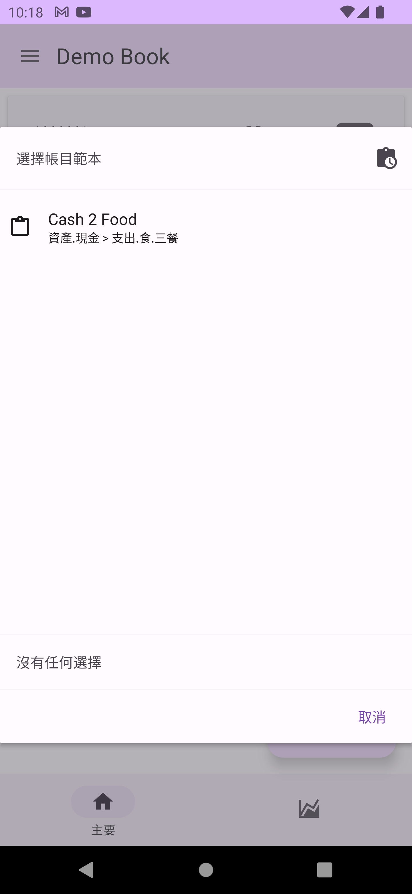

 

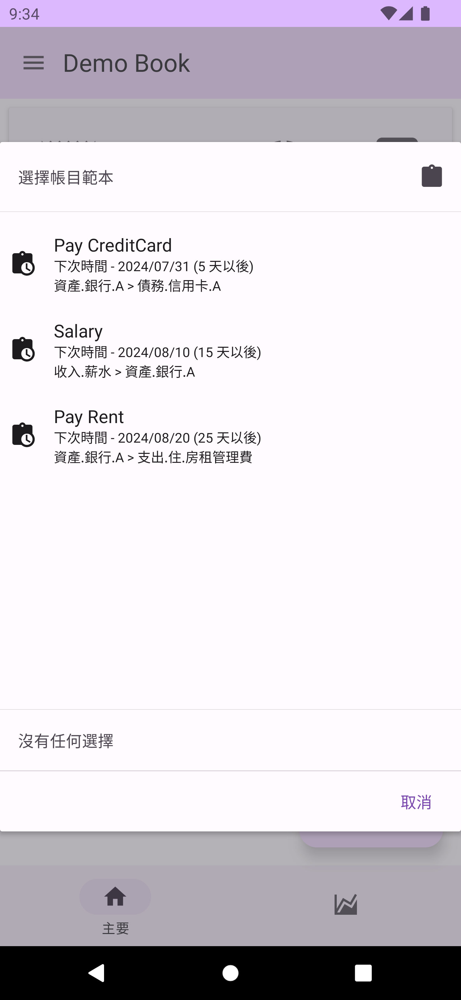

## 到期排程

當排程到期當天或已過期，在主頁上會出現`到期排程`按鈕，並顯示目前有幾個到期。(若要略過某到期排程範本，請到帳目範本列表使用`重新開始`功能)

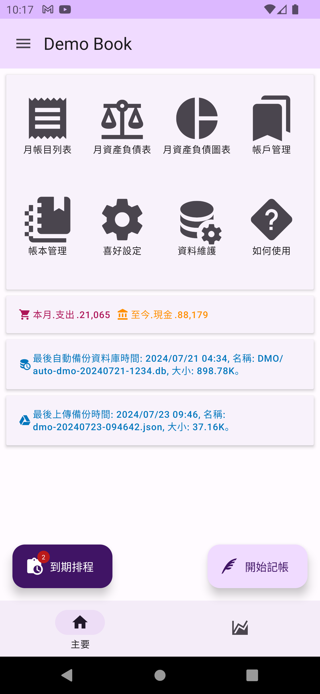

點選`到期排程`按鈕則會出現到期排程範本列表對話窗，並依時間先後順序排序，你可以選擇任一到期範本建立帳目。建立完帳目後，DMO將會自動依排程時間(到期時間)及排程設定，設定到下一次的排程日期。

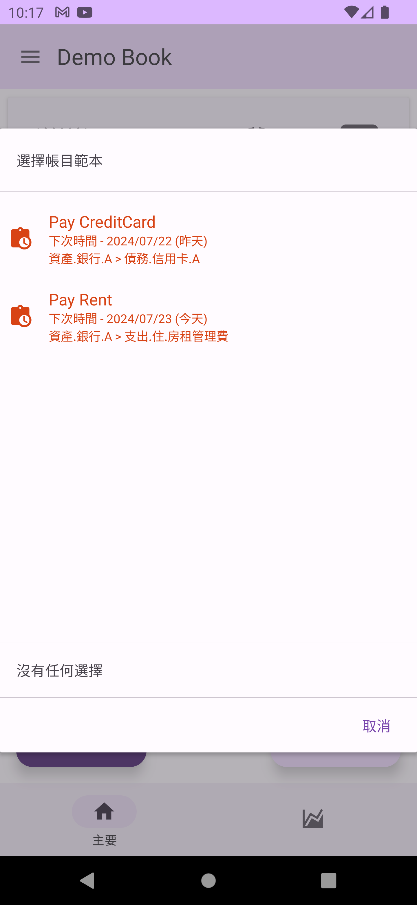

