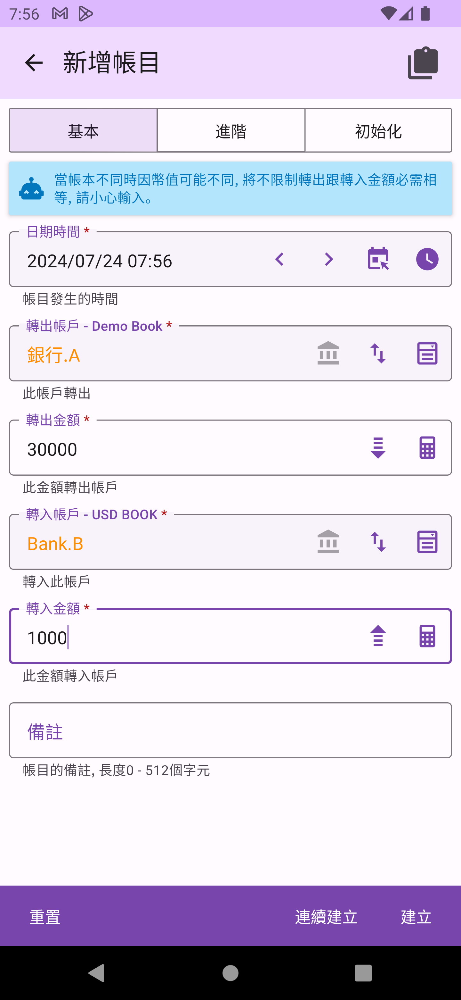

## 帳目

帳戶是記帳的核心[概念](concept.md)中的第三項。使用本 App 時，您最常進行的操作應該就是建立帳目。

### 開始記帳
點選主頁右下角的`開始記帳`，或是帳目列表上方的`建立帳目`圖示，即可進入新增帳目頁面。在新增帳目時，您可以選擇三種方式：

1. **基本型**：即一對一帳目。
2. **進階型**：即一對多帳目。
3. **初始化型**：即零對一帳目。

一般記帳通常使用的是基本型，進階型在[一對多分帳](#一對多分帳)時使用，初始化型的用途是作為[帳戶的初始化](account.md#初始化帳戶)。

#### 基本型帳目
在新增基本型帳目時，您必需填入轉換時發生的日期和時間（除非您在意，否則通常時間不必精確，時間也可用作列表排序依據）、轉出的帳戶、轉入的帳戶及相關金額。您也可以輸入備註，來讓自己日後查詢時，有更多的資訊。

在選擇轉出及轉入帳戶時，提供帳戶挑選工具以方便您選擇。

#### 帳本間互轉
本App允許不同帳本間的互轉。在使用帳戶挑選工具時，您可以點選右上角的切換按鈕切換到帳本挑選。選擇帳本後，即可挑選不同帳本中的帳戶。

當選擇了不同帳本的帳戶時，您需要分別填入轉出金額及轉入金額。由於帳本不同，幣別可能有所差異，App將不限制轉出金額必須等於轉入金額。

#### 一對多分帳

一對多分帳（或多對多分帳）通常發生在信用卡相關的消費中。例如，在大賣場使用信用卡刷卡，購買食物及日常用品等屬於不同帳戶的消費。或者在支付信用卡費時，額外產生的國外交易手續費在當時消費計帳時未被記錄。這兩個常見的例子，都非常適合使用進階型帳目。當然，您可能會遇到更複雜的情況，只要您的帳目金額是正確的，您可以靈活應用這些功能來管理您的帳目。

在新增進階型帳目時，您需要填入轉換時發生的日期和時間（時間不需精確，可作排序依據），並選擇一至多個轉出帳戶及一至多個轉入帳戶。每個轉出、轉入帳戶的金額都需獨立填入。當所有帳戶都屬於同一帳本時，App會限制轉出金額總和必須等於轉入金額總和；若帳戶屬於不同帳本，則不作此限制。

### 帳目列表

App 提供固定時間區間的帳目列表，並依最晚到最早的帳目轉換日期時間順序列出區間內主要帳本的帳目（若是從帳本選單進入，則列出該帳本的區間內帳目）。在列表的下方，顯示區間內資產負債的小計及時間前後切換的導航條。

### 固定及任意區間查詢
帳目列表右上方的選單可以切換成不同的區間模式，或選擇自定區間。

### 分享XLSX
帳目列表右上方的選單可將該區間內的帳目分享成XLSX格式，方便保存或進行其他資料處理。

### 帳目功能

您可點選各帳目進行編輯，或利用左右滑動來查看個項不同功能操作。在帳本右滑為丟棄及刪除功能。

在帳本左滑為編輯，複製及建立範本功能。

### 編輯帳目

編輯帳目時，您可以變更帳目的所有資料。資產負債表的統計是即時的，只要保持正確的時間、帳戶及金額，就不必擔心會對統計結果造成錯誤。

### 複製帳目

複製帳目時，會帶入該帳目的資料，並在編輯後建立一筆新的帳目。這通常用於以前發生的項目上。如果某項目真的非常頻繁發生，您也可以考慮使用建立範本的功能。

### 建立帳目範本

建立範本時，會複製帳目的資料，並建立一個帳目範本，供日後快速建立相同的帳目，或週期發生的帳目。詳細資訊請參考[帳目範本](transaction-template.md)。

### 丟棄及刪除帳目

有時候您會因為記錯帳而需要刪除帳目。刪除操作是不可逆的，並且會影響該帳本的資產負債統計。因此，如果在刪除時沒有十足的把握，您可以選擇使用丟棄帳目功能。被丟棄的帳目會被標記，不會出現在列表中，也不會被資產負債統計到，並且可以在日後還原。這樣在記錯帳需要刪除時，您可以放心地丟棄帳目，而不必擔心無法回復。

### 搜尋

利用搜尋功能，您可以使用各項條件來查詢相關的帳目。

搜尋結果列表的帳目，可以用左右滑動的方式進行各項操作。另外，搜尋時不會包含被丟棄的帳目。

### 最後異動帳目

最後異動帳目依照最後異動時間由近到遠排列，這樣可以方便查找剛剛修改的帳目，避免忘記修改的內容或異動時間導致帳目在區間列表中消失。使用最後異動帳目功能，可以很容易找到剛才修改的帳目。

### 垃圾筒

垃圾筒中的帳目依照最後異動時間由近到遠排列。使用右上角的刪除全部功能圖示，可以批次刪除所有被丟棄的帳目。

你也可以右滑帳目，使用還原或刪除功能來單獨處理被丟棄的帳目。

