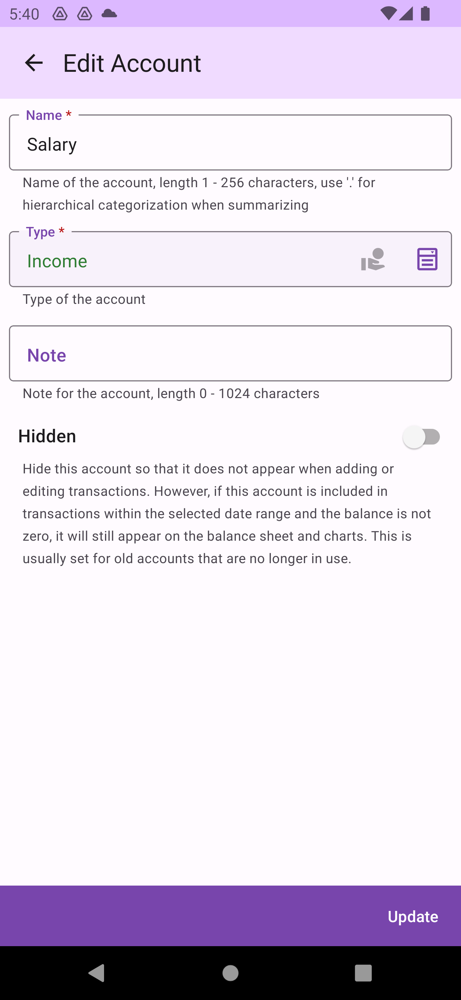

# Account

The account is the second core [concept](concept.md) of accounting. You can manage accounts under the same book on the `Account Management` screen.

## Account Types

Accounts are classified into five major types: <mark style="color:green;">`Income`</mark>, <mark style="color:yellow;">`Asset`</mark>, <mark style="color:red;">`Expense`</mark>, <mark style="color:purple;">`Liability`</mark>, and <mark style="color:blue;">`Other`</mark>.

## Add Account

Click `Add Account` to enter the screen for adding a new account. When adding an account, consider the name you want to use, and you can use the `.` character to create a hierarchical classification. In the [balance sheet](balancesheet.md), such classifications will be aggregated based on parent nodes. For example, `Housing.Rent`, `Living.Utilities`, and `Housing.Phone Network` will all be aggregated under the parent node `Housing`.

Besides the name, you also need to choose an account type, which helps DMO handle the presentation.

## Account Functions

You can edit each account by clicking on it or swipe left and right to view different operational functions. The `Delete` function is on the left side of the book.

The `Edit`, `Transaction List`, and `Initialize` functions are on the right side of the book.

## Edit Account

When editing an account, you can change the account's name and type. The calculation on the balance sheet are real-time, so as long as the correct name and type are maintained, you do not need to worry about errors in the calculation results.

## Transaction List

The transaction list shows all related transactions for the account within a specific period, including transfers between different books.

## Initialize Account

Initializing an account involves adding a one-time initial transaction for the account. This usually happens when you first create a new account or start using DMO, to set an initial value for the account, such as bank deposits, used credit card amounts, or cash on hand. The initial transaction does not require a transfer date. It will only be counted if the balance sheet's calculation period does not include the start date.

## Delete Account

When an account is deleted, some related transaction data will also be deleted. This operation will affect the balance sheet statistics of the book and is irreversible, so proceed with caution. Since DMO supports transfers between different books, if a transaction belongs to multiple books, only the part of the data in that book will be deleted, and it will not affect the overall account of other related books. However, when querying the non-related book's transaction, the deleted one-sided data (transfer out or transfer in) will be missing.