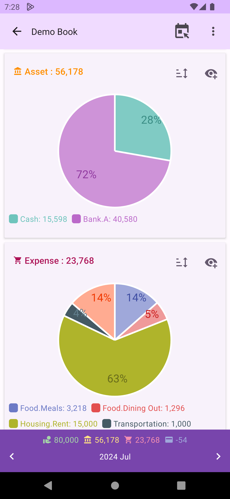
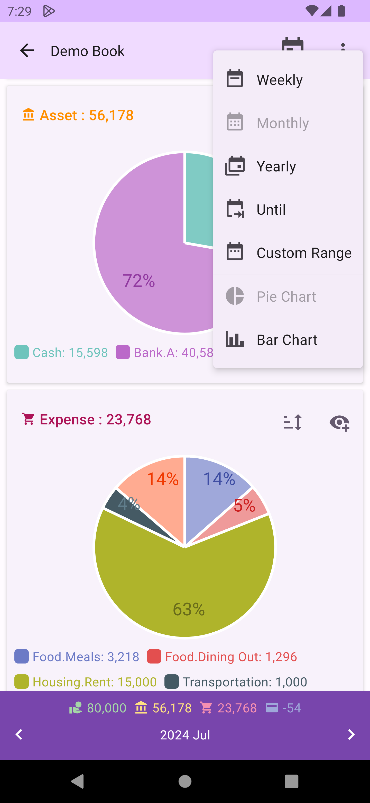
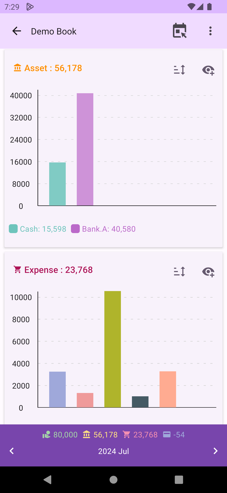

# Balance Chart

DMO provides various balance charts for fixed time intervals and custom time intervals. Below the charts, the balance within the interval and the navigation bar for switching between times are displayed.

## Fixed and Custom Interval Queries

The menu at the top right of the balance charts can switch to different interval modes (weekly, monthly, yearly, up to today/selected date), or choose `Custom Range`.

## Pie Charts and Bar Charts

The menu at the top right of the balance charts can switch to `Pie Chart` or `Bar Chart`.

## Add to Quick View

Click the `Add to Quick View` icon at the top right icon of a chart to add the the balance chartto the [Quick Charts Tab](home.md) on the homescreen. For example, you can see a pie chart of this year's expenditure ratio on the quick charts tab.