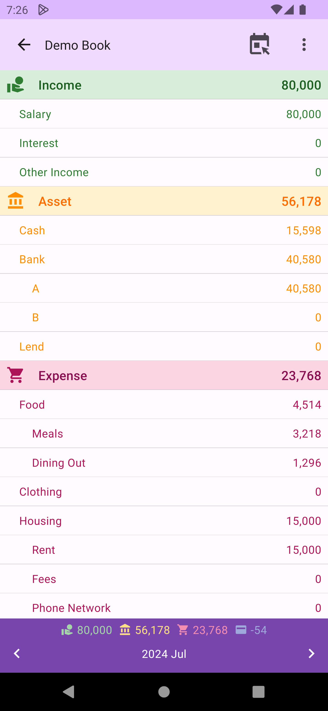
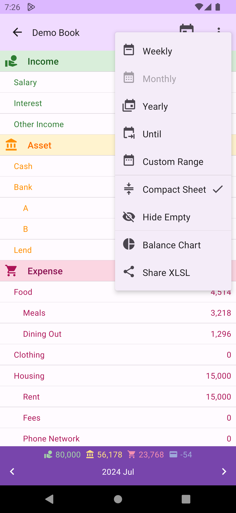
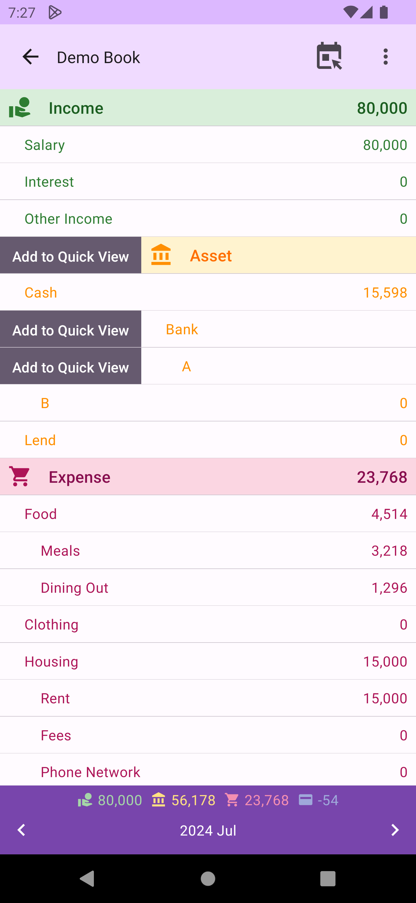
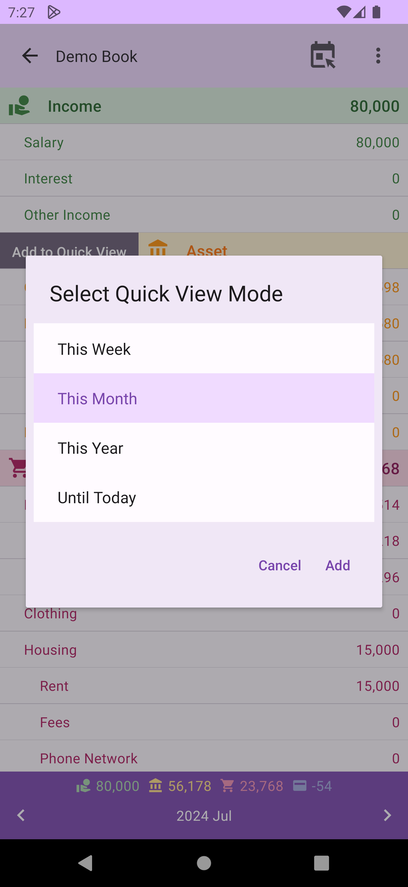

# Balance Sheet

DMO provides balance sheets for various fixed time periods and custom time periods. At the bottom of the list, the balance within the period are displayed, along with a navigation bar to switch between different time periods.

## Hierarchical Sheet

When naming accounts, you can use `.` to create hierarchical account names. In the balance sheet calculation and display, accounts will be shown grouped by the parent(pseudo) account hierarchy, allowing you to understand the total value of each account and parent account.

## Fixed and Custom Period Queries

The menu at the top right of the balance sheet allows you to switch between different period modes (weekly, monthly, yearly, until today/a specific day), or choose `Custom Range`.

## Balance Chart

The menu at the top right of the balance sheet allows access to the [Balance Chart](balancechart.md) for all account types in that period.

## Share XLSX

The menu at the top right of the balance sheet allows sharing the sheet content as an `XLSX` file, making it easy to save or perform other data processing.

## Item Functions

You can click on each item to enter the transaction list for that item (including account type, account, and parent account), or swipe left or right to see different function operations. The left side is `Add to Quick View` function.

On the right side of all items is the `Transaction List` function. For account type items, there is an additional `Balance Chart` function for that single account type.

## Add to Quick View

This function allows adding items (including account types, accounts, and parent accounts) to the quick view on the home screen. For example, you can quickly see this month's expenses or current cash on hand on the home screen.

## Transaction List

This function allows entering the transaction list for that item (including account categories, accounts, and parent accounts) for the current period.

## Balance Chart

This function allows accessing the [Balance Chart](balancechart.md) for that account type.