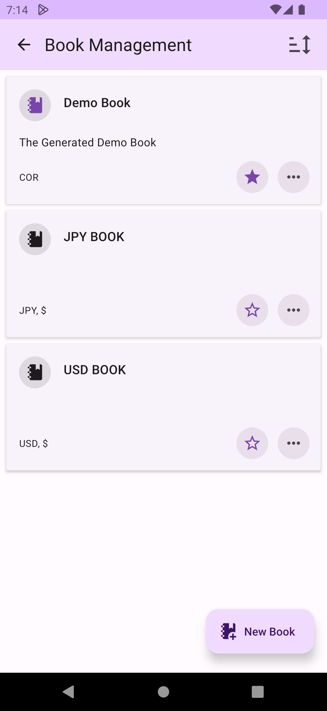
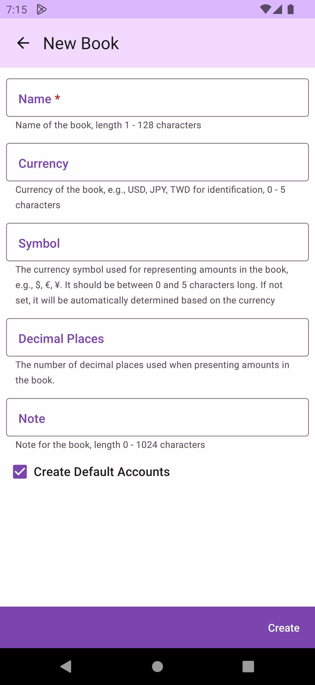
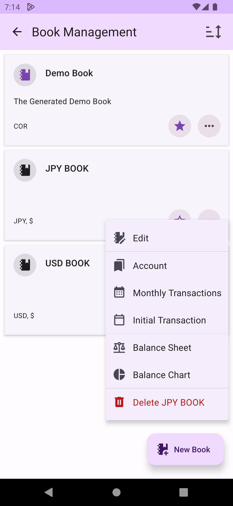
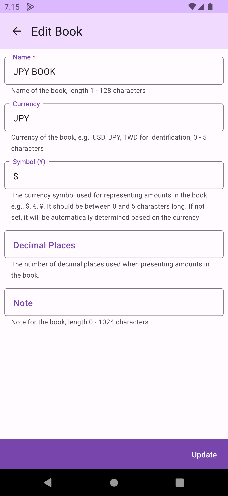

# Books

The Book is the first core [concept](concept.md) of accounting. You can manage multiple Books on the `Book Management` screen, including setting a `Primary Book`, adding or deleting Books, and editing and viewing related information for each Book.

## Add a Book

When adding a new Book, you must provide a name for the Book. Currency and symbol are optional. If the Book requires decimal places, you need to specify the number of decimal places. Additionally, you can choose whether to create default Accounts or start from scratch by creating the Accounts you need.

## Book Menu

In the Book menu, you can view the `Accounts`, `Transaction List`, `Initial Transactions`, `Balance Sheet`, and `Balance Chart` of the Book without switching the primary Book status, or `Delete Book`.

## Edit Book

When editing a Book, you can change various settings of the Book without affecting any Account and Transaction data.

## Delete Book

When you delete a Book, the Book, its associated Accounts, and the Transactions that belong solely to that Book will be deleted. This operation is irreversible, so please proceed with caution. Since DMO supports transfers between different Books, if a Transaction is related to multiple Books, only the part of the data associated with the deleted Book will be removed, and the data of the Books not deleted will not be affected. However, when querying the related Transactions of the non-deleted Books, the single-sided data (withdrawals or deposits) of the deleted part will be missing.
