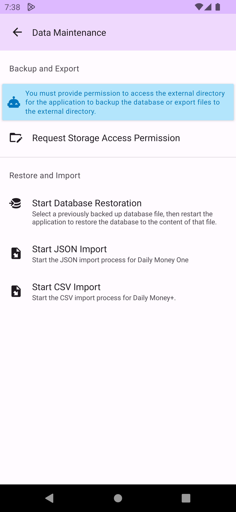
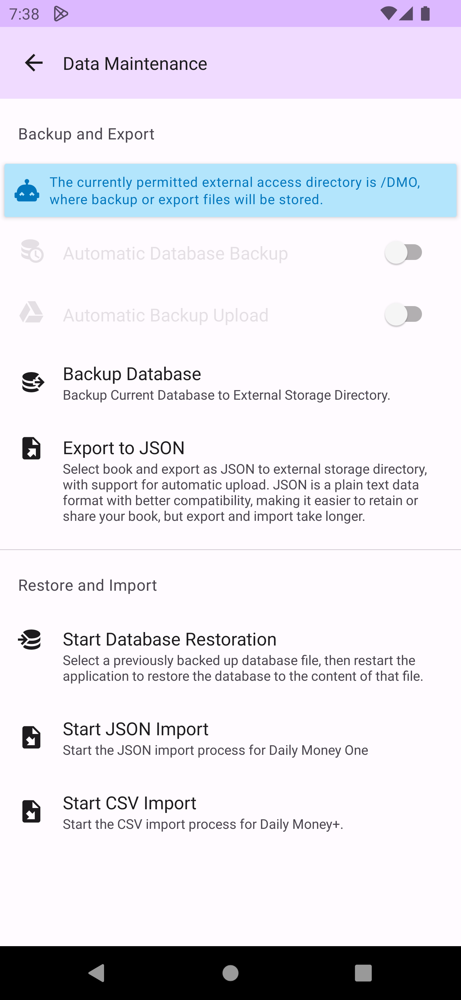
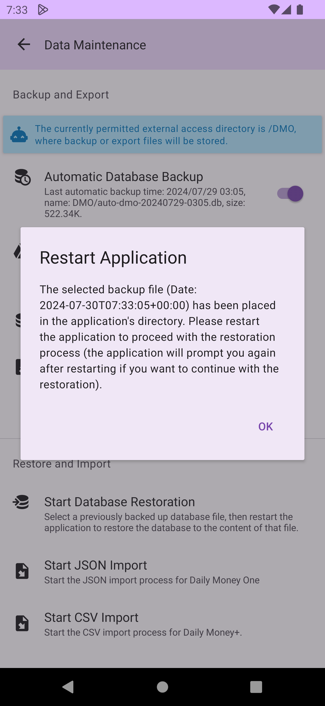
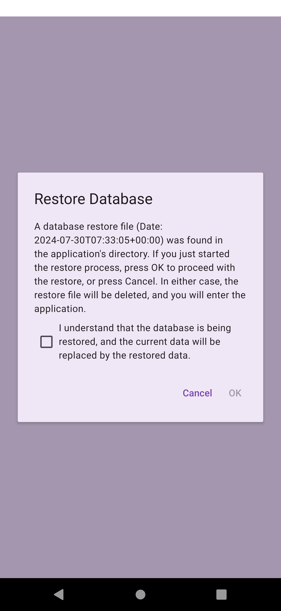
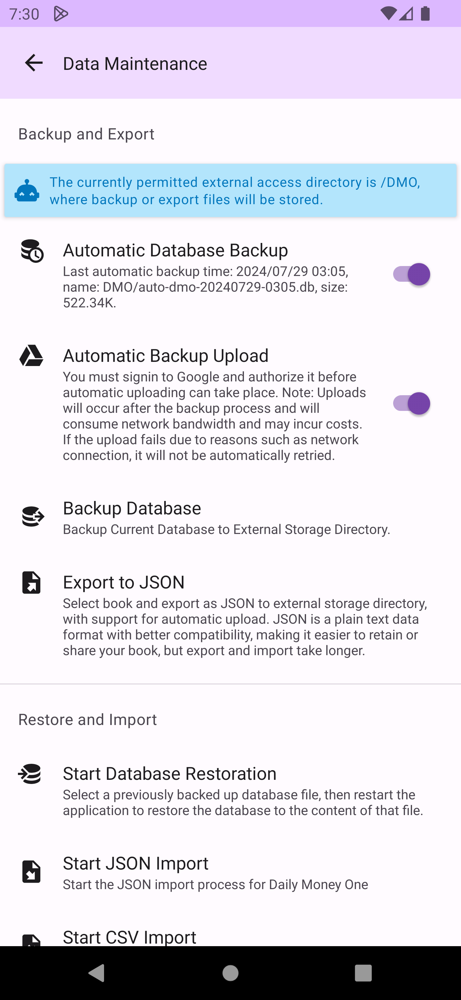
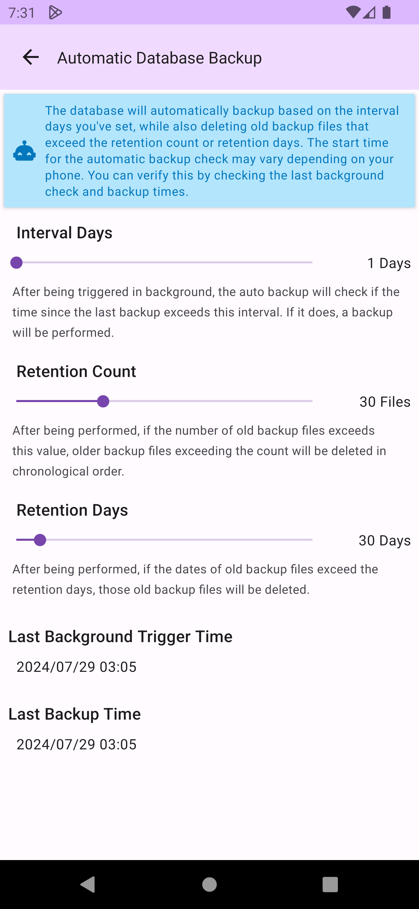
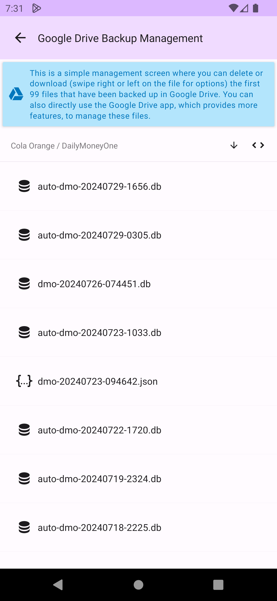
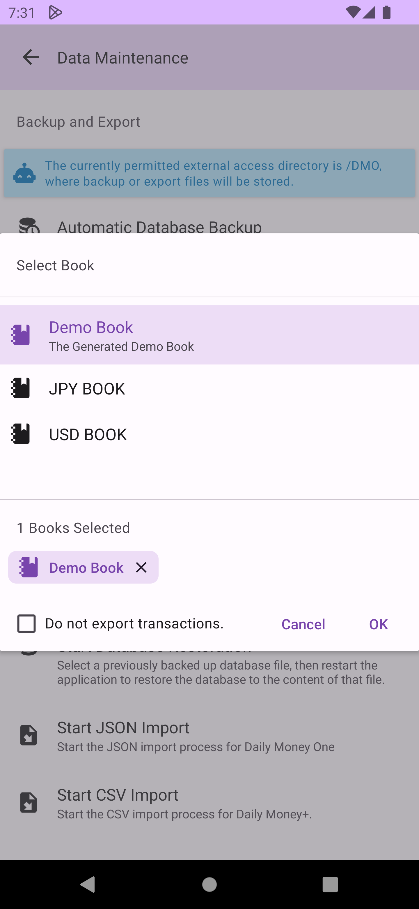
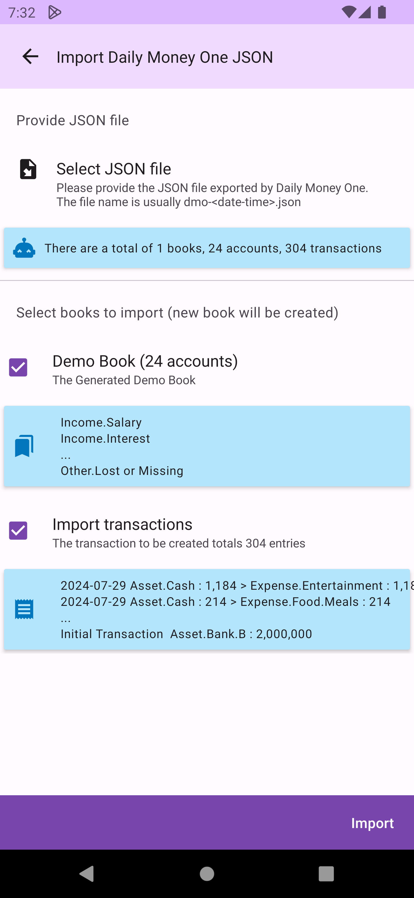
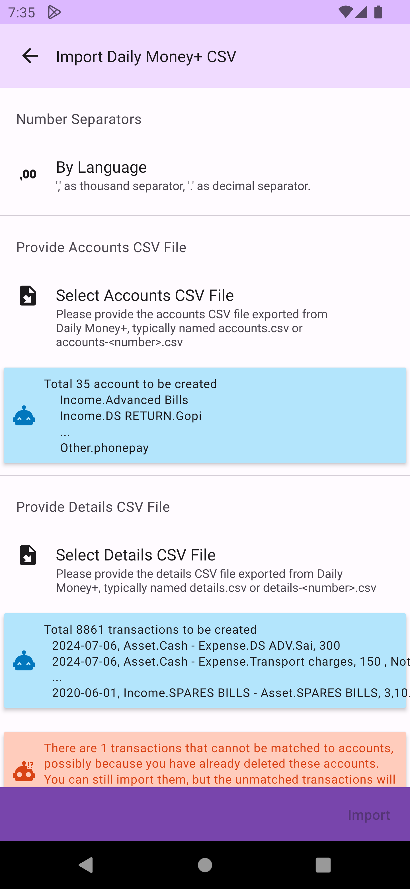

# Data Maintenance

The data maintenance screen allows for multiple types of data backup, restoration, export, and import operations.

## Obtaining Storage Permission

Before performing database backup or export, you must allow DMO to access your external directory. Please click `Request Storage Access Permission` and specify a specific directory for DMO to use for database backup and data export (do not use the top-level directory, as some mobiles do not allow DMO to access the top-level directory).

## Database Backup and Restoration

Database backup copies the DMO database file to the external directory. The final step of the restoration process directly replaces the DMO database file, making it the fastest and most comprehensive method for data backup and restoration. Click `Backup Database` to back up the database file to the external directory, with the file name formatted by date and time (dm-_YYYYMMDD-HHmmss_.db).

After clicking `Start Database Restoration`, a database file selection screen will pop up. Please select the database backup file to be used for restoration. DMO will copy this file into it, then restart DMO (Please manually remove the DMO process using the process manager) to enter the restoration step.

After DMO restarting, you will be asked again if you are sure you want to proceed with the restoration. Click `Confirm` to proceed or `Cancel` to skip the restoration. <mark style="color:red;">Please note that restoration is irreversible. Make sure you have a reliable backup and have selected the correct restoration file</mark>.

## Automatic Database Backup

You can choose whether to enable the `Automatic Database Backup` feature. Once enabled, DMO will automatically back up the database according to your settings (the actual execution time of the automatic backup may vary depending on the mobile).

You can set the backup `Interval Days`, `Retention Count`, and `Retention days` on the automatic database backup screen.

## Automatic Upload to Google Drive

You can choose whether to enable the `Automatic Backup Upload` feature. Once enabled, DMO will require you to log in to your Google Drive account and grant access permissions (if you do not want to upload automatically in the future, you can log out from the login information section in the [sidepanel](home.md#side-panel)) of home screen.

After logging in and granting access permissions (Config and specific files read permissions are required; these permissions will not allow DMO to read any of your other non-DMO created files), DMO will create a DailyMoneyOne directory in the Google Drive root directory and automatically upload the files to that directory when performing database backups or data exports. You can perform simple file deletion and download management on this screen.

## Export and Import Data JSON Files

Using the `Export to JSON` feature allows you to export data such as books, accounts, and transactions into JSON format. You can select the books to export and whether to include their transactions. (Exporting and importing JSON will take more time than database backup and restoration)

Click `Start JSON Import` to import previously exported JSON format files. At this time, you can choose the books to import and whether to include their transactions. DMO will create new books and accounts. Books with the same name will not be replaced or overwritten.

## Import Daily Money+ CSV

If you are an old user transferring from Daily Money+, please first export the CSV file from Daily Money+ (make sure to choose UTF8 encoding when exporting. If you have changed the `Preferences > Developer > CSV Encoding` setting in DM+ to another encoding, you need to change it back before exporting to ensure correct import into DMO). Then click `Start CSV Import` to import the CSV file exported by Daily Money+ (refer to [video](https://www.youtube.com/watch?v=IkZsiJ5TAyw)). If the thousand separator and decimal point format used in your area are not `,` and `.`, please select the appropriate character settings first. Then select the CSV file to import. DMO will create new books and accounts, and books with the same name will not be replaced or overwritten.

