# Desktop Application

The desktop application is a built-in web app in [Server Mode](server-mode.md). Once Server Mode is started, you can use other devices on the same network to connect and use `Daily Money One Desktop` via a browser. The connection URL is typically: `http://<IP>:<Port>/desktop/`

## Connection Authroization

After successfully connecting, you will first enter the authroization screen where you need to input the connection token set when Server Mode was started. After passing authroization, you can proceed to use the application. The authroization remains valid until you exit the application or close all browser tabs. For security, please exit the application and turn off Server Mode on your phone when not in use.

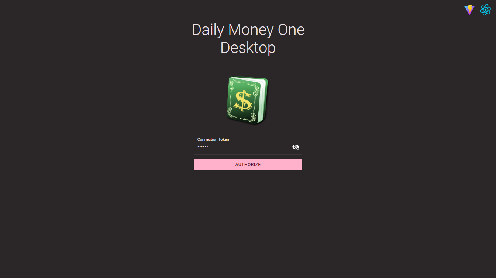

## Home Page

After passing authroization, you will enter the Home Page by default. On the left side is a side menu where you can select major features or exit the application. The top toolbar has a book selection dropdown on the left and a time range selector on the right.
The first row of the Home Page displays the current year's statement status by default, with two bar charts showing `Assets vs. Liabilities` and `Income vs. Expenses`. The second row lists the statement status of accounts under the first account type, in order of account types preferences.

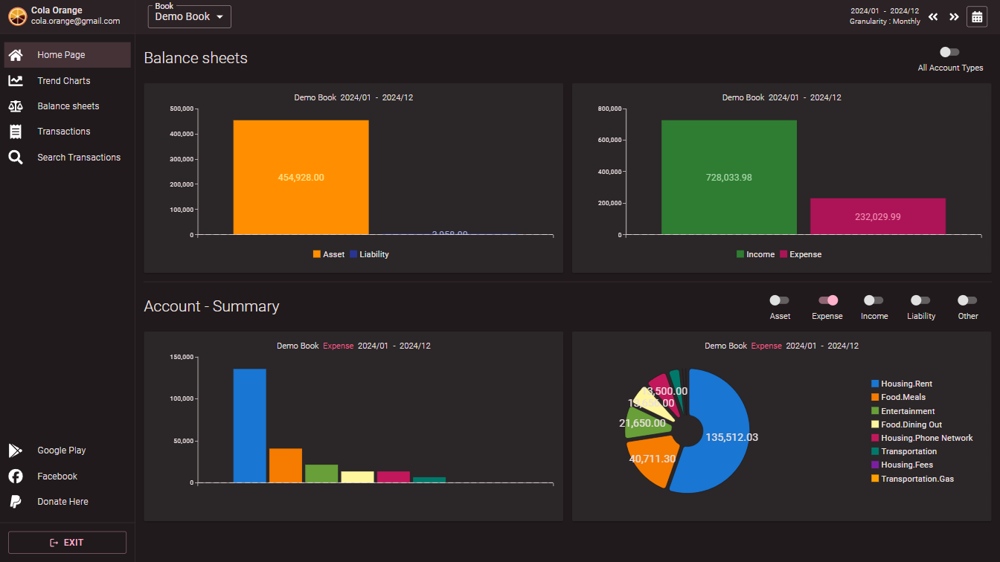

You can use the left and right arrow buttons on the right side of the toolbar to switch to the previous or next time range, or open the time range adjustment dialog to modify the time range.

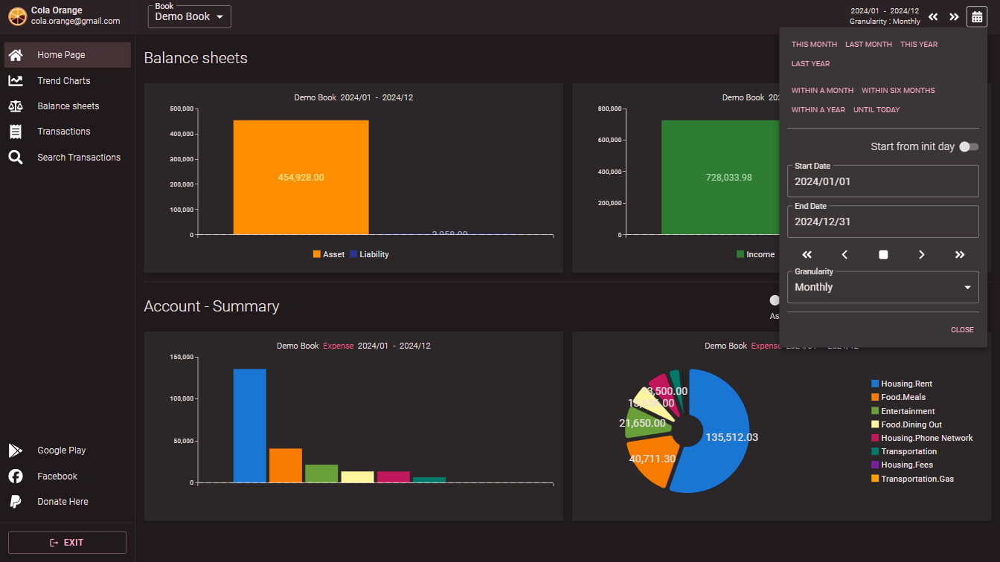

In the first row of the Home Page, you can enable the `All Account Types` option to display all account types in a single set of bar charts for comparison (`Other` will appear in this mode).

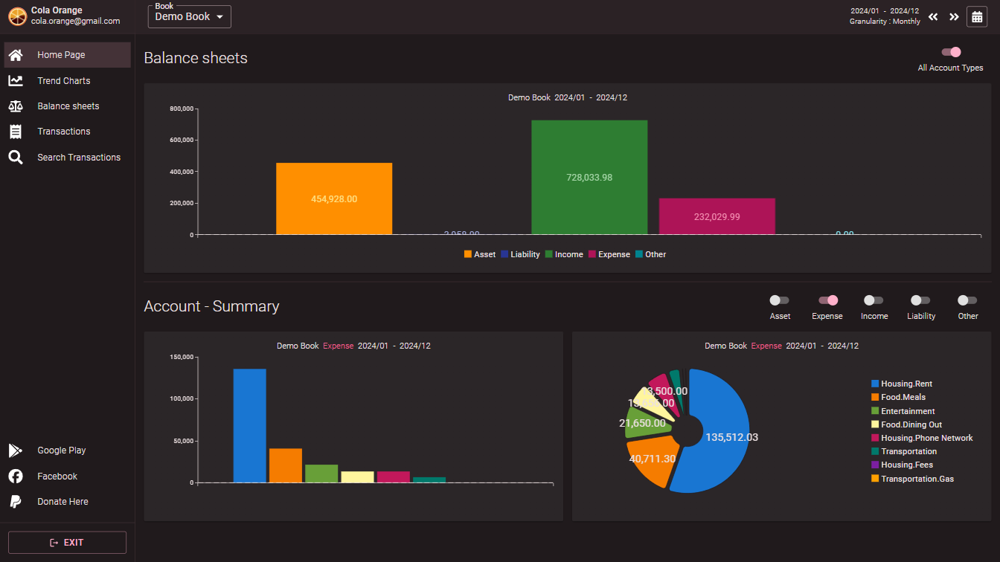

In the second row and beyond, you can select the account type you wish to view to check the account statement for that time range.

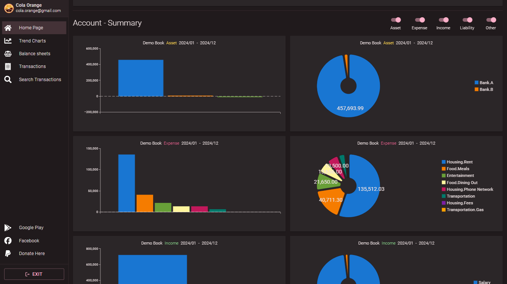

## Trend Charts

By clicking on `Trend Charts` in the side menu, you can view trends for each account type or individual accounts over the selected time range (i.e., the amounts within the time granularity of the range). The first row displays two line charts: `Assets vs. Liabilities` and `Income vs. Expenses`. The second row displays line charts for the accounts within the first account type, in order of account types preferences.

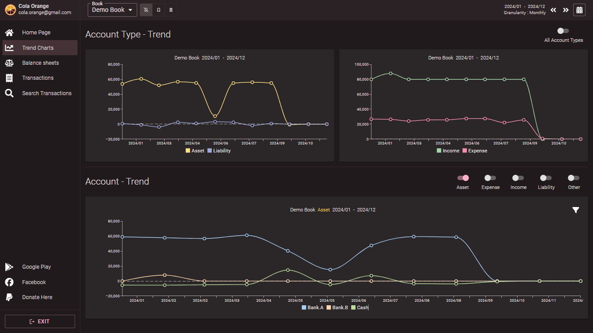

On the toolbar, you can enable the `Accumulated Amount` option, which will accumulate the totals for each granularity within the time range and display them as an area chart.

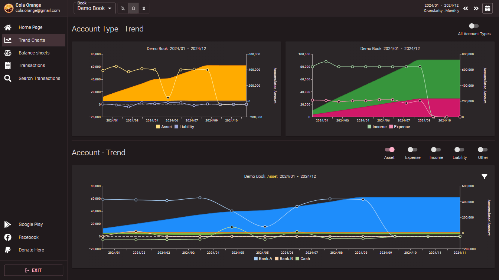

Additionally, you can enable the `Init & Accumulated Amount` option. This option adds the initial value and the amounts before the selected time range to the accumulated amounts, displaying them as an area chart. This feature helps visualize changes in your total assets and liabilities or individual accounts over time since you started tracking your finances by Daily Money One.

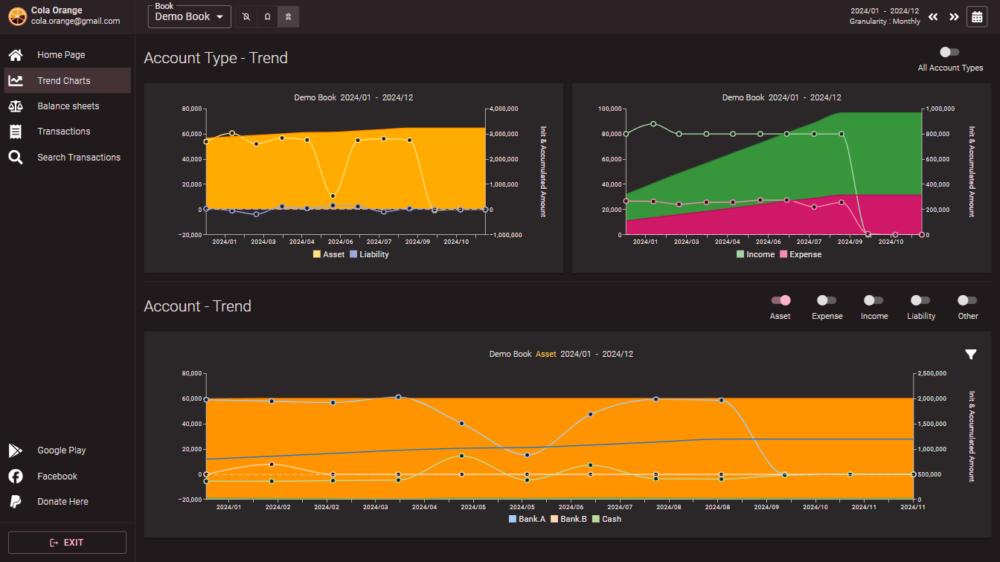

The second row of charts shows the trend for the selected account type and also supports the `Accumulated Amount` and `Initial & Accumulated Amount` options.

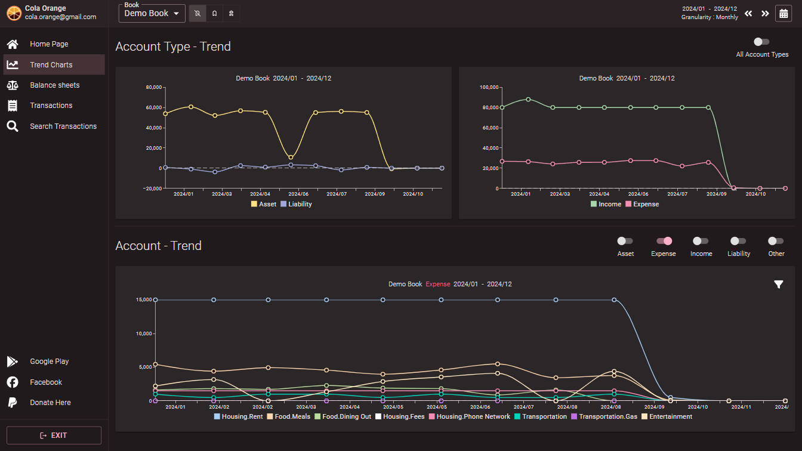

When there are many accounts in a account type, you can use the account filter feature on the right side of the chart to select the accounts you want to view.

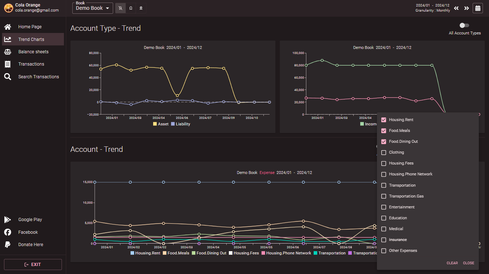

The account filter feature is independently configured for each account type and displays the current number of filtered accounts.

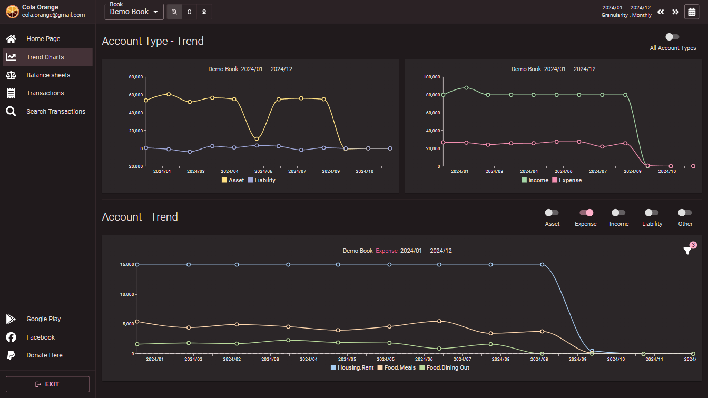

## Other Features

Still under development...