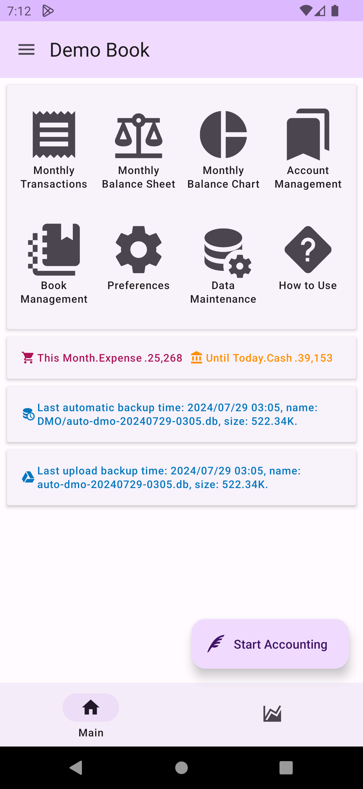
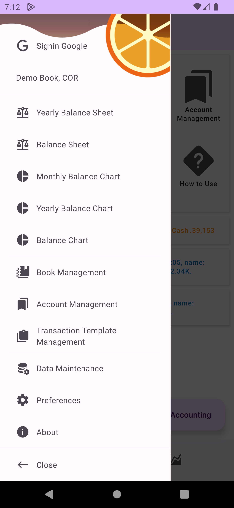
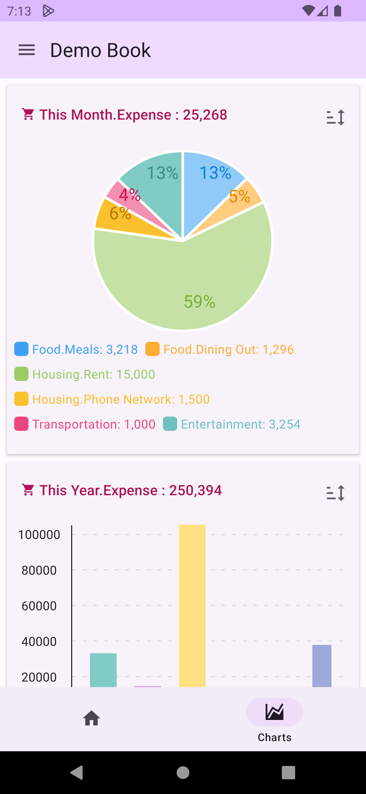

# Home Screen

The `Home Screen` serves as the entry point for DMO, where you can quickly access various features, customize shortcuts, view commonly used balance sheets and charts, and find important information. The menu at the top left opens the side panel, and the tabs below switch between main features, quick chart and more functionalities.

## Side Panel

In the side panel, you can access all features and log in/out of Google to upload backup files to Google Drive.

## Quick Chart Tab

In the Quick Chart tab, you can customize frequently viewed charts, such as weekly or monthly expenditure charts.

