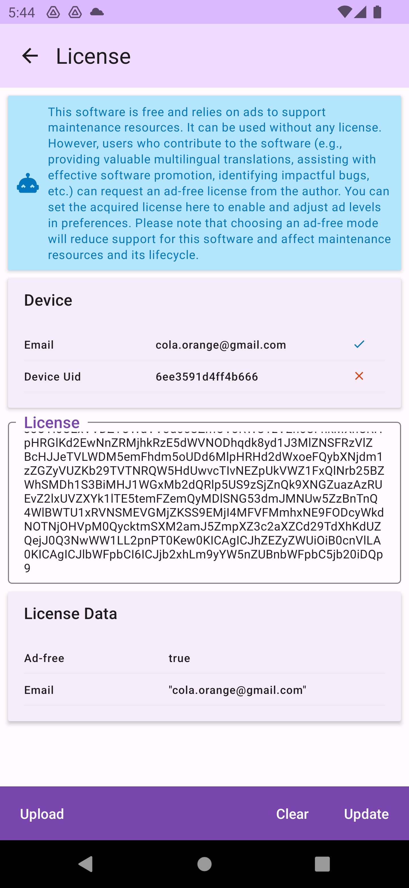

# License

This software is free and relies on advertisements for maintenance resources, so no license is required for use. However, users who contribute to the software (such as providing useful multilingual translations, helping with effective software promotion, or assisting in identifying significant bugs) can request a license from the author.

## Importing a License
You can set the acquired license in the `About > License` screen. The license can be bound to either an email address or a device's unique code; if either one matches, the license is considered valid. You can then set the advertisement level in the preferences. Please note that choosing an ad-free mode will reduce support for this software, affecting its maintenance resources and lifecycle.

* An ad-free license may be time-limited or unlimited, depending on the content of the acquired license.
