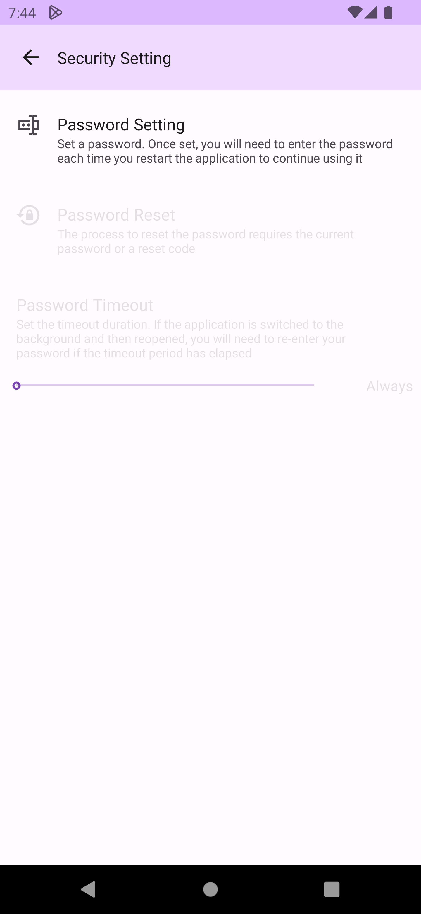
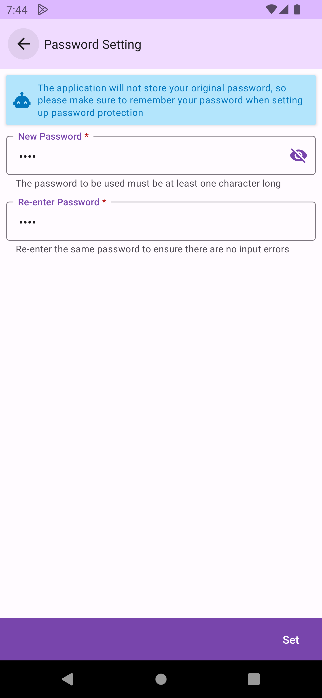
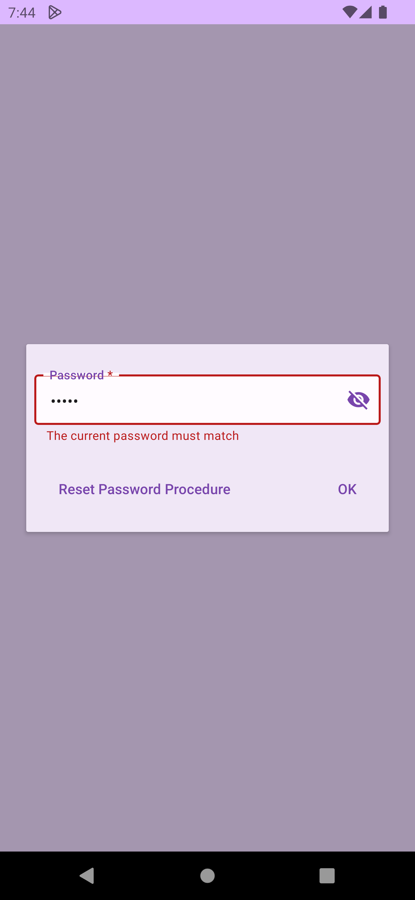
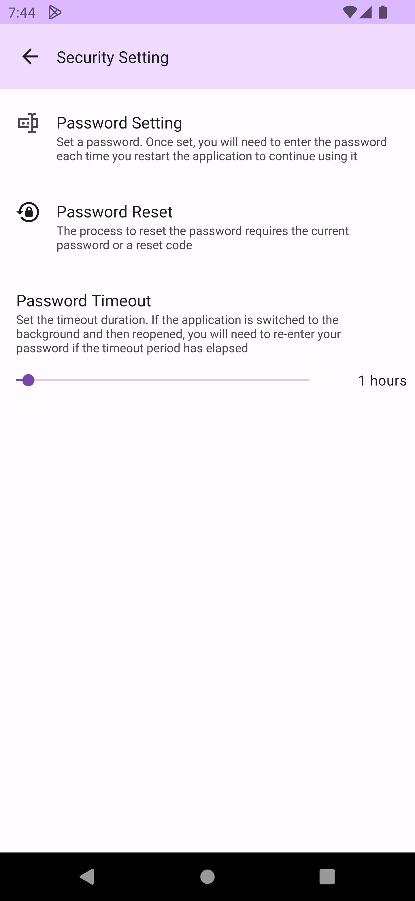
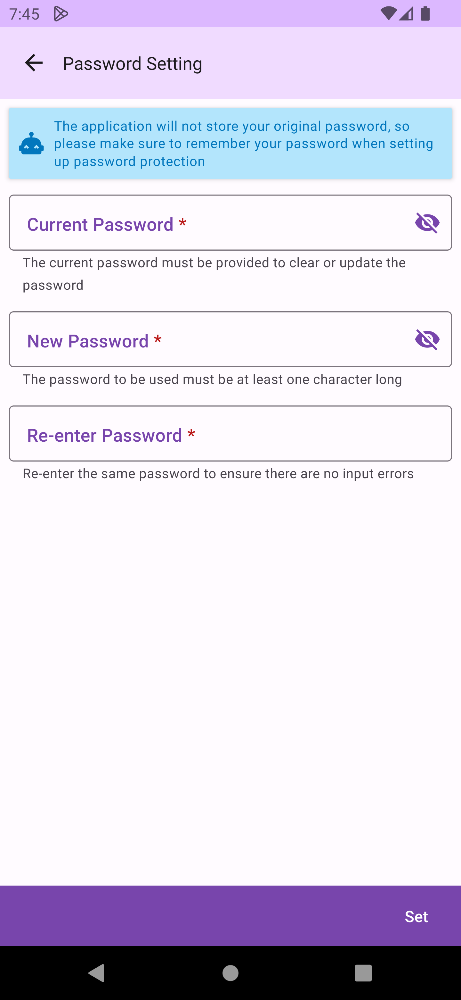
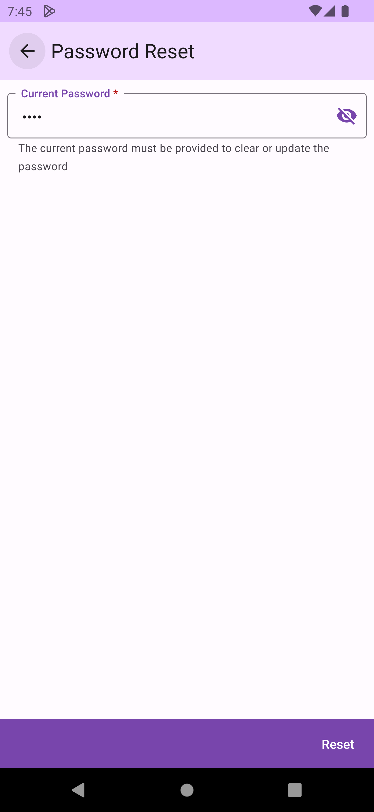

# Password Protection

The password feature provides user authentication for DMO. If a password is set up, users will be prompted to enter it when DMO is launched, verifying their identity before they can continue using it.

## Setting Up a Password

On the `Preferences > Security Settings` , use the `Password Setting` to create a password. Once the password is created, forgetting it will affect your usage since DMO does not store your original password. Please make sure to remember your password.

 

## Verifying the Password

After DMO starts or is switched to the background and then brought back to the foreground, users will be prompted to enter the password to verify their identity.

## Timeout Settings

After setting up the password, you can also configure the password timeout duration. If the application switches between background and foreground within the timeout period after verification, it will not prompt for the password again. If the application is restarted under any circumstances, it will always prompt for the password.

## Changing or Resetting the Password

You can change the password or reset the password (to disable the password feature). The current password is required to change or reset the password.

 

