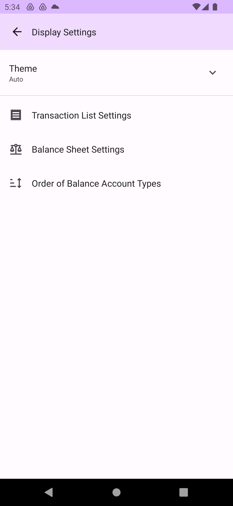

# Preferences

Preferences provide various settings beyond accounting data.

## Language Settings

Set the language used by DMO. By default, it follows your phone's language settings.

## Display Settings

Configure various display-related options.

### Themes

Set different color themes.

### Order of Balance Account Type

Set the order of account types in the balance sheet and chart.

## Date and Time Settings

Configure date and time formats and related options.

## Security Settings

Configure various security options. Refer to [Password Protection](password.md).

## Home Screen Settings

Configure options related to the home screen.

### Home Screen Shortcut Settings

Rearrange the home screen shortcuts.

### Balance Sheet Quick View Settings

Reorder or delete items in the quick view of the balance sheet on the home screen.

### Balance Charts Quick View Settings

Reorder or delete items in the quick view of the balance charts on the home screen.

## Advertisement Settings

Configure the level of applied advertisements.

