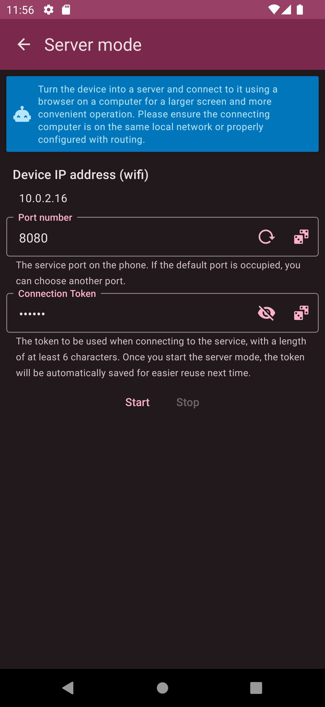
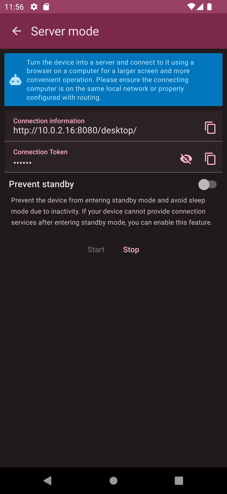

# Server Mode

Server mode allows you to turn your phone into a server, enabling you to connect from a computer or other devices within the same network LAN to access books, accounts, transactions, or related charts. With the ability to use a mouse, keyboard, and a larger screen on a computer, you’ll find it more convenient to view and manage your financial information.

## Connection Settings

Upon entering the server mode screen, you will see your phone's current network IP (depending on the actual network condition). Since the connecting devices must be within the same network LAN, it is recommended to use a Wi-Fi connection or enable Wi-Fi hotspot mode. Before starting server mode, you need to provide a port number and a connection token. The port number must be between 1024-65535, and the connection token must be longer than 6 digits. You can change these values as desired, and the values from the last use will be automatically saved after starting the server. Make sure to protect your connection token to prevent other users in the same network domain from connecting once they know your IP and port number. It is recommended to use a new random token each time you start the server.

## Connection Information

After starting server mode, the screen will display the connection information (URL, `http://<IP Address>:<Port>/desktop/`) along with the connection token you just entered. Open a browser on a computer or device within the same network LAN, enter the URL, and you will be directed to the [Desktop Application](desktop.md). After entering the token for authroization, you will be able to view the data on your phone. Additionally, most phones will enter standby mode after being idle for a period (e.g., screen turning off), which will prevent server mode from continuing to provide service. To avoid this, you can enable the `Prevent Standby` option to keep your phone from entering standby mode. Since the phone will keep the screen on in this state, consuming battery, make sure to plug in your phone to keep it charged.

