# Transaction Templates

The Transaction Template feature is used to quickly create common transactions and provide scheduling for recurring transactions. You can create a new template using the [Create Template](transaction.md) option in the transaction list.

## Creating a Transaction Template

When creating a template, the selected transaction data will be included, but the transfer time will not be. Besides providing a name for the template, you can also choose whether to apply the withdrawals account, deposits account, value, and notes, which will be used when creating transactions using this template in the future.

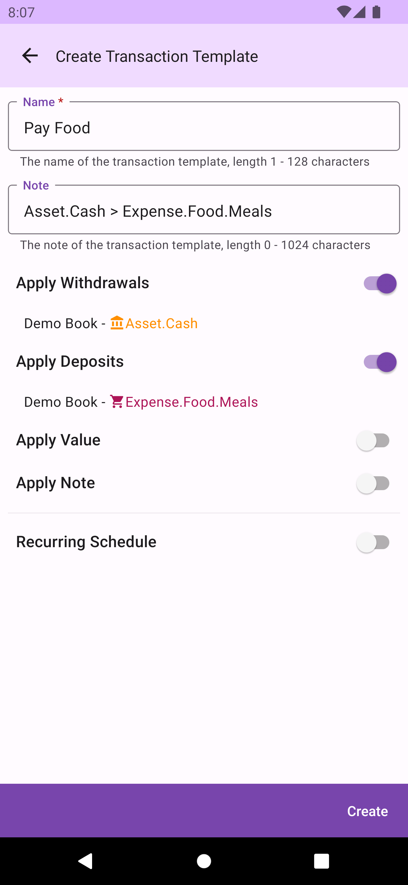

You can also set whether to enable the recurring schedule. Templates without a schedule are referred to as `Normal Templates`, otherwise known as `Scheduled Templates`.

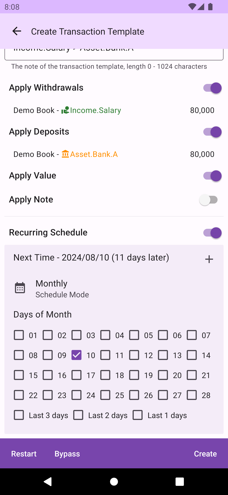

Recurring schedules are divided into three modes: weekly, monthly, and yearly.

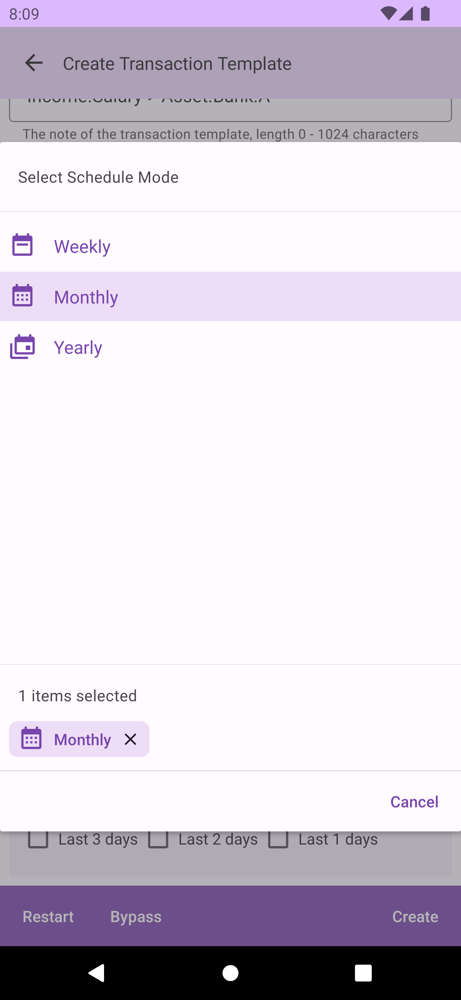

You can set multiple schedules for a single transaction, with each schedule having its own mode, making it easier to meet your needs. After each setting, DMO will automatically select the nearest next date as the scheduled date.

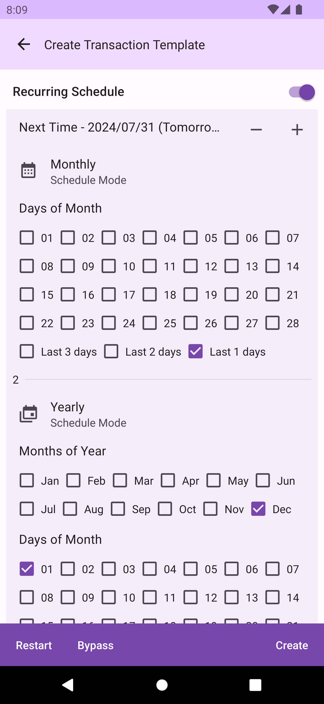

## Managing Transaction Templates

In the transaction template management screen, there are two tabs: `Normal` and `Schedule`, listing the created normal templates and scheduled templates respectively.

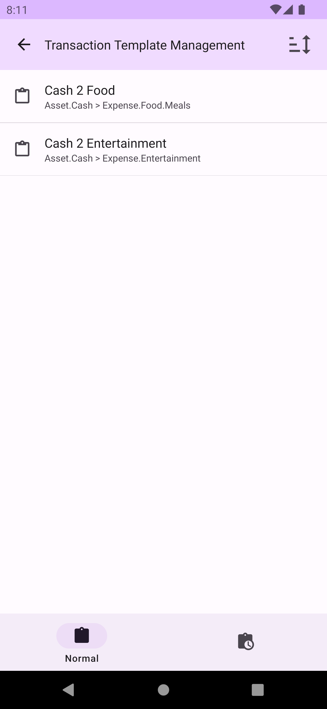

 

## Transaction Template Functions

You can click on each template for `Edit`, or swipe left and right to view different functional operations. The `Delete` function is on the left side of the book.

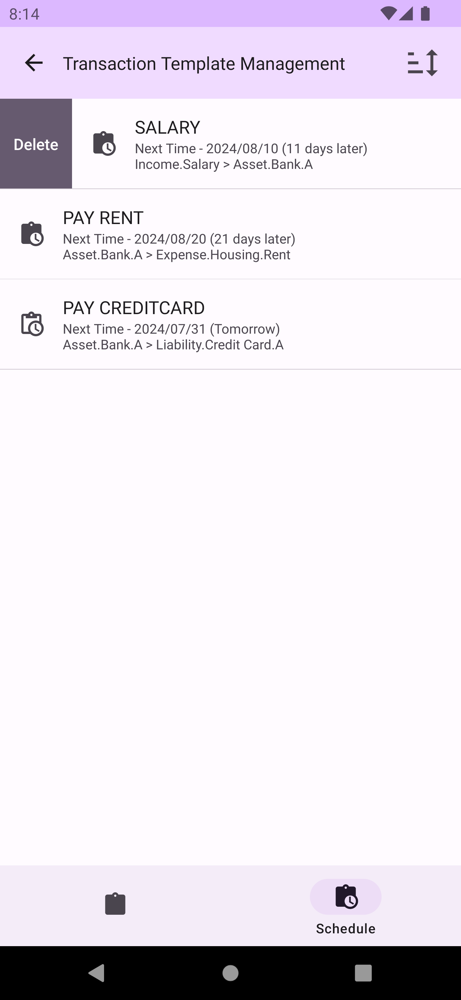

On the right side of a normal template are the `Edit` and `New Transaction` functions. The New Transaction function will bring the template data into the transaction creation page, allowing you to quickly add a transaction.

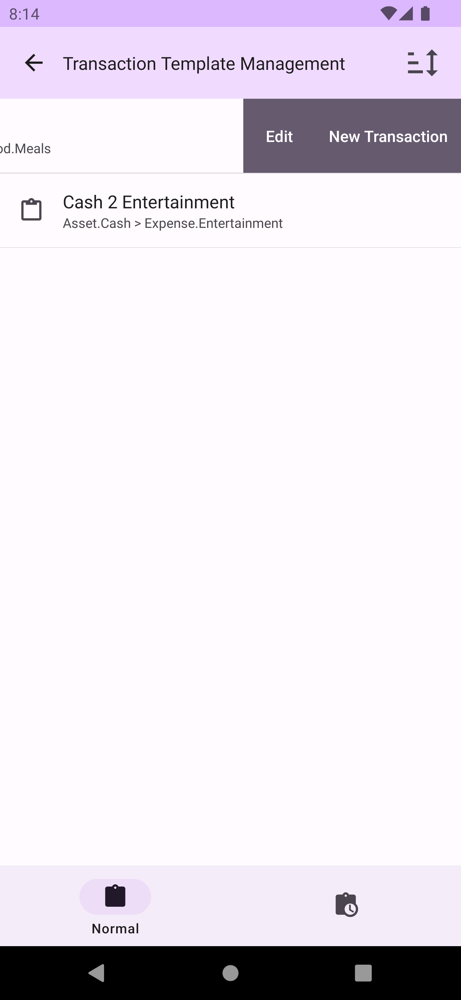

In addition to the `Edit` and `New Transaction` functions, scheduled templates also have the `Restart` and `Bypass` scheduling functions. `Restart` will reset the scheduled date using the `current date` and `schedule settings`. `By pass` will set the scheduled date using the `current scheduled date` and `schedule settings`.

## Editing a Transaction Template

When editing a transaction template, you can modify the name, settings, and schedule (currently, the function to modify cloned transaction data is not provided, and will be available in the future).

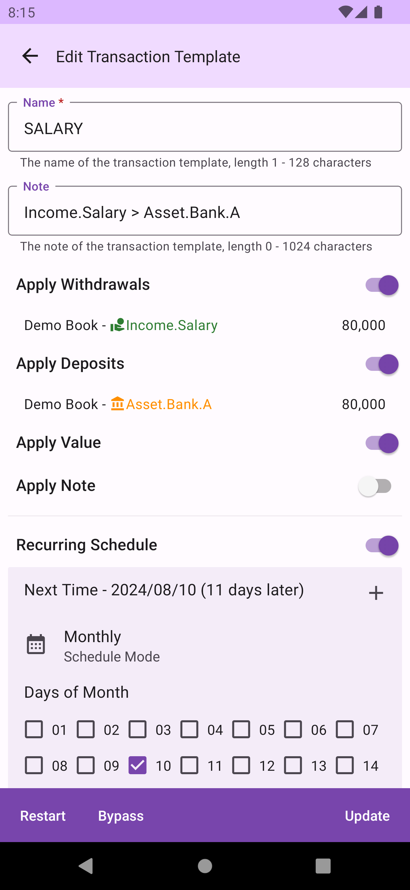

## Quickly Calling Out a Transaction Template Dialog

Long press the `Start Accounting` button on the home screen to call out the transaction template dialog, and select a transaction template to create a new transaction. You can switch between normal templates and scheduled templates by clicking the icon in the upper right corner of the dialog. The scheduled template list is sorted by scheduled date from earliest to latest.

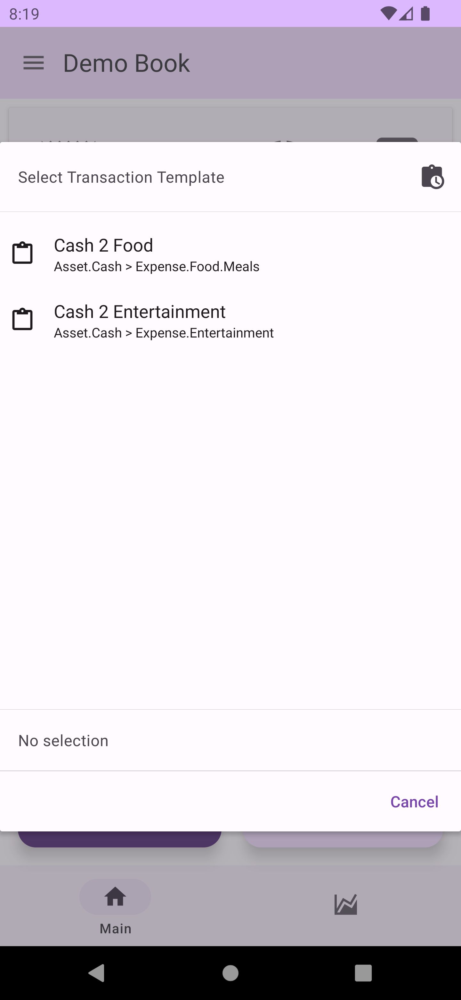

 

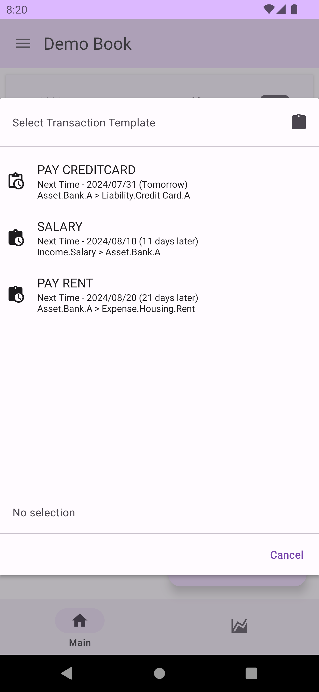

## Expired Schedule

When the schedule is due or expired, a `Expired Schedule` button will appear on the home screen, showing the number of expired items. (To skip a expired schedule template, please use the `Restart` function in the transaction template management screen)

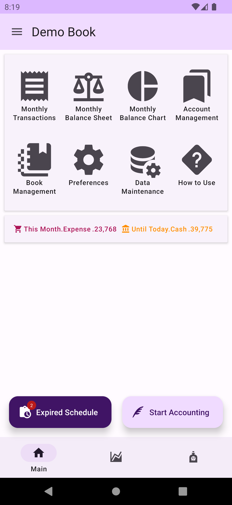

Clicking the `Expired Schedule` button will bring up the expired schedule templates dialog, sorted from earliest to latest. You can click any expired template to create a transaction. After the transaction is created, DMO will automatically set the next schedule date based on the schedule time and schedule settings.

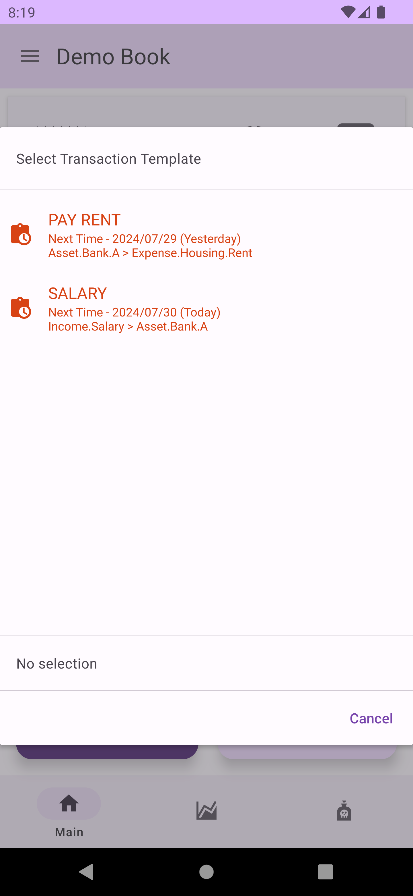

