# Transactions

Transactions are the third core [concept](concept.md) of accounting. When using DMO, creating transactions will be one of the most frequent operations.

## Start Accounting

Click on `Start Accounting` at the bottom right of the home screen or the `Add Transaction` icon at the top of the `Transaction List` to enter the page for adding transactions. When adding transactions, you can choose from three modes:

1. **Basic**: A one-to-one transaction.
2. **Advanced**: A one-to-many transaction.
3. **Initialization**: A zero-to-one transaction.

Typically, basic accounting is used for `Basic` transactions, `Advanced` transactions are used for [one-to-many splits](transaction.md#One-to-Many%20Split), and the `Initialization` mode is used for [Initialize Account](account.md#Initialize%20Account).

### Basic Transactions

When adding a basic transaction, you must fill in the date and time of the transaction (time is generally not critical unless needed for sorting), the account from which funds are transferred out, the account to which funds are transferred in, and the amount involved. You can also enter notes for future reference.

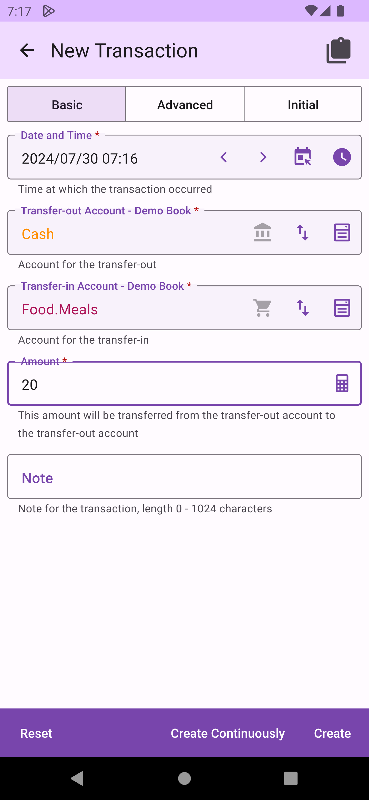

When selecting the accounts, use the account selection tool, which lists accounts in the order set on the `Account Management` screen.

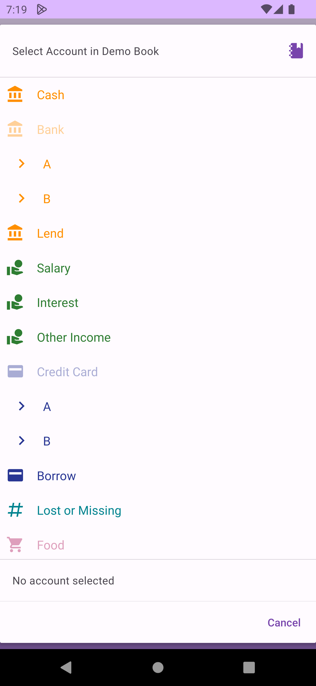

### Inter-Book Transfers

DMO allows for transfers between accounts in different books. When using the account selection tool, you can click the `Switch Book` icon at the top right to switch to another book and select an account from that book.

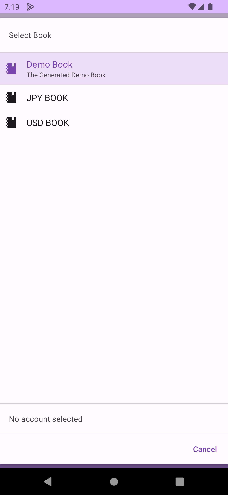

When selecting accounts from different books, you need to enter both the transfer-out and transfer-in amounts. Since the currencies might differ between books, DMO does not require that the outgoing amount equals the incoming amount.

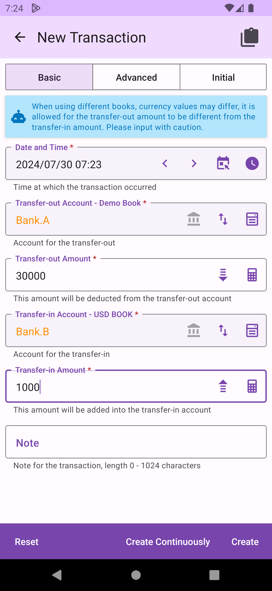

### One-to-Many Split

One-to-many splits (technically many-to-many) usually occur in credit card transactions, such as purchasing groceries and daily necessities in a supermarket with a credit card, which fall under different accounts, or in paying credit card fees where foreign transaction fees were not recorded at the time of the original transaction. These scenarios are well-suited for advanced transactions. You might encounter more complex situations, and as long as your transaction amounts are correct, you can flexibly manage your transactions.

When adding an advanced transaction, you need to fill in the date and time of the transaction and select one or more outgoing accounts and one or more incoming accounts. Each account's amount must be entered separately. When all accounts belong to the same book, DMO will require the total outgoing amount to equal the total incoming amount. If any account belongs to a different book, this restriction does not apply.

 

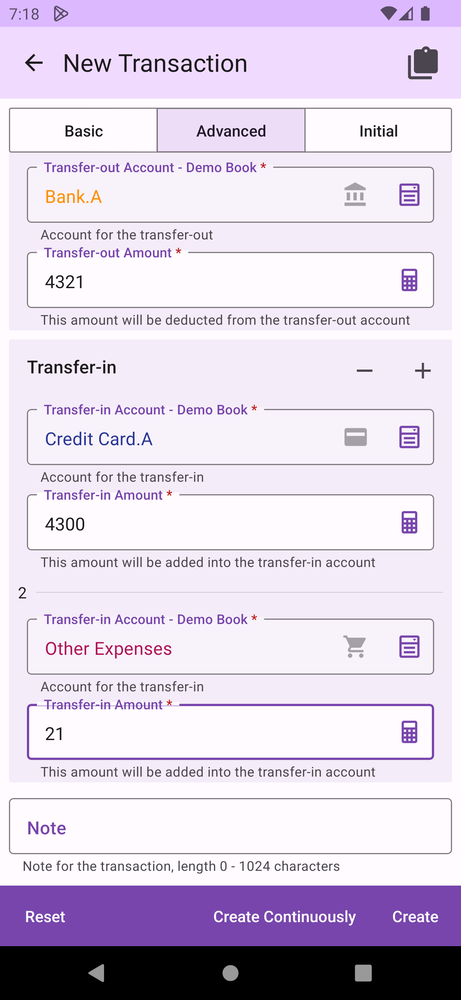

## Transaction List

DMO provides transaction lists for various fixed and custom time periods, listing the transactions of the primary book in order from the latest to the earliest transaction date and time within the period. At the bottom of the list, there is a blance for the period and navigation to switch between periods.

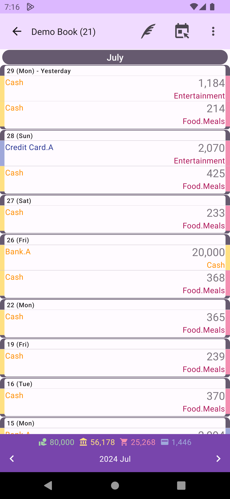

## Fixed and Custom Period Queries

The menu at the top right of the transaction list allows switching between different period modes (weekly, monthly, yearly, until today/specific day) or selecting `Custom Period`.

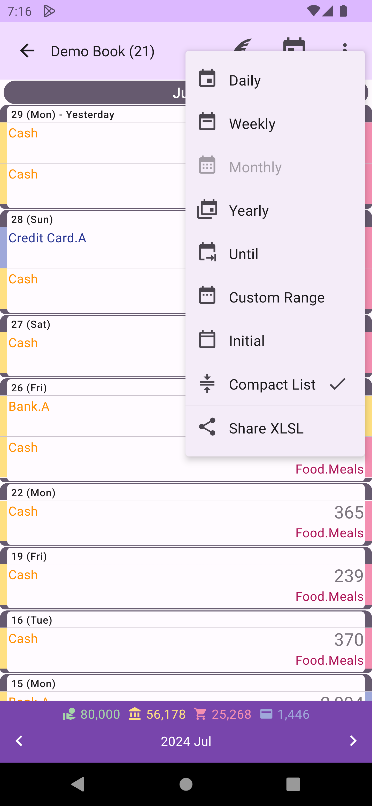

## Share XLSX

The menu at the top right of the transaction list allows sharing transactions within the period in `XLSX` format for easy storage or further data processing.

## Transaction Functions

You can edit transactions by clicking on them, or use the left and right swipe to access different function options. On the left side of the transaction, there are `Trash` and `Delete` functions.

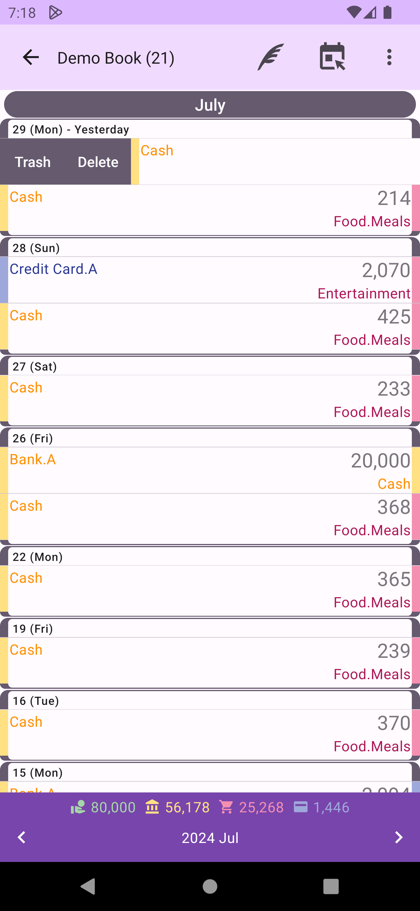

On the right side, there are `Edit`, `Copy`, and `Create Template` functions.

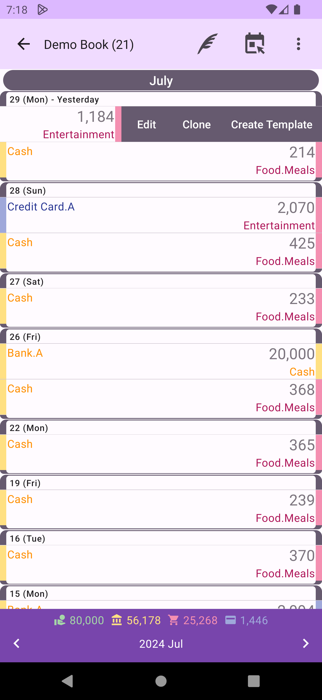

## Edit Transaction

When editing a transaction, you can change all its details. The calculation of the balance sheet are updated in real-time, so as long as the time, accounts, and amounts are correct, there is no need to worry about errors in the results.

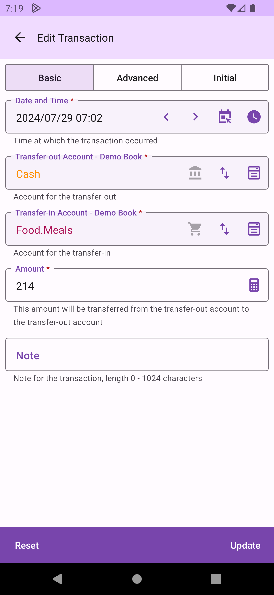

## Clone Transaction

Cloning a transaction will copy the details of the transaction, and after editing, it will create a new transaction. This is usually used for repeating transactions. If a transaction happens very frequently, you might consider using the `Create Template` function.

## Create Transaction Template

When creating a template, it copies the transaction details and creates a transaction template for quickly creating similar or recurring transactions in the future. For more information, refer to [Transaction Templates](transaction-template.md).

## Trash and Delete Transactions

Sometimes you might need to delete a transaction due to an mistake. Deleting is irreversible and affects the balance sheet. If you're not entirely sure, you can choose to `Trash` the transaction. Trahsed transactions are marked, won't appear in the transaction list, and aren't included in the balance sheet, but can be restored later. This way, you can discard transactions without worrying about not being able to recover them if needed.

## Search

Using the search function, you can query related transactions based on various conditions.

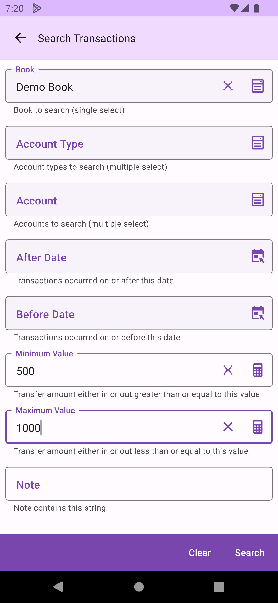

Search results are listed in order of transfer time. You can use the left and right swipe for different function options. Trashed transactions are not included in the search results.

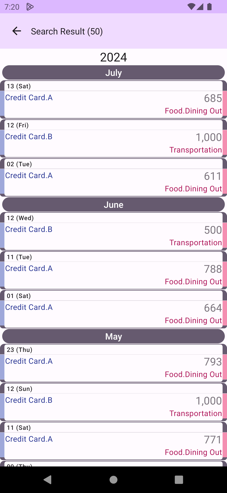

## Updated Transactions

Updated transactions are listed from the most recent to the earliest modification time, making it easy to find recently modified transactions and avoid having transactions disappear from the current period transaction list due to changes in the transfer time. This function helps you quickly find recently modified transactions.

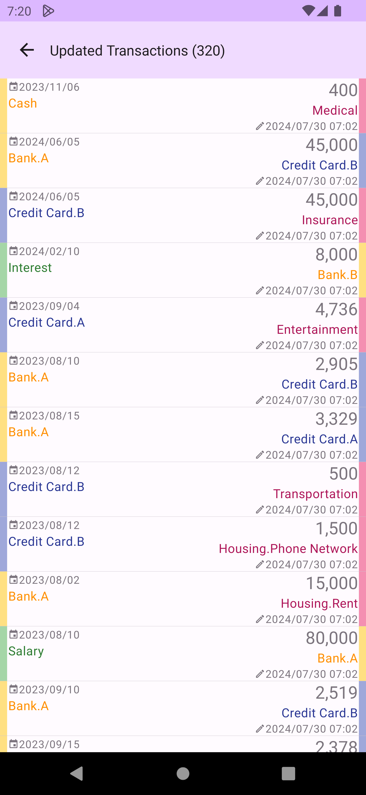

## Trash

Transactions in the trash are listed from the most recent to the earliest modification time. You can batch delete all trashed transactions using the delete all icon at the top right (deletions are irreversible).

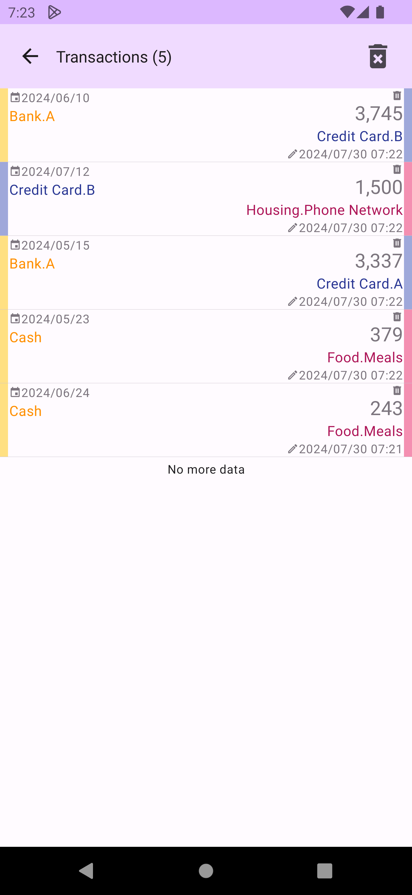

On the left side of each transaction, you can use the `Restore` or `Delete` functions to handle individual trashed transactions.

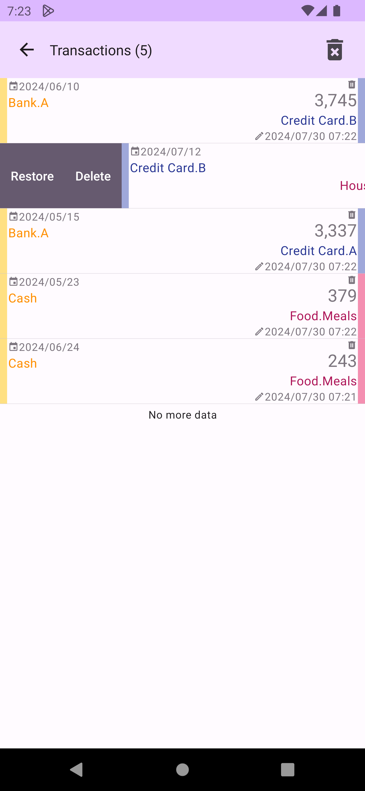

